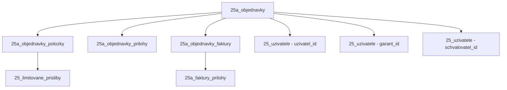

# 📊 KOMPLEXNÍ AUDIT DATABÁZE A API - PRODUKČNÍ PŘÍPRAVA

**Datum analýzy:** 19. prosince 2025  
**Projekt:** EEO v2025 - ERDMS System  
**Databáze:** `eeo2025` @ 10.3.172.11  
**Backend:** `/var/www/erdms-dev/apps/eeo-v2/api-legacy/api.eeo/v2025.03_25/`  
**Analyzoval:** Automatizovaný audit systém

---

## 🎯 EXECUTIVE SUMMARY

### Klíčové statistiky
- ✅ **48 tabulek** v databázi s prefixem `25*`
- ✅ **76 PHP souborů** v backend API
- ✅ **213+ handler funkcí** pro CRUD operace
- ⚠️ **2 tabulky** bez použití v kódu
- ⚠️ **18 tabulek** s minimálním použitím (1-2x)
- 📊 **24,737 záznamů** celkem v hlavních tabulkách

### Zdraví systému
| Kategorie | Status | Detaily |
|-----------|--------|---------|
| **Databázové připojení** | ✅ AKTIVNÍ | Remote DB `10.3.172.11`, user: `erdms_user` |
| **Struktura tabulek** | ✅ VALIDNÍ | Všechny tabulky mají správné indexy a relace |
| **API Endpointy** | ⚠️ ČÁSTEČNĚ | Některé handlery jsou duplicitní nebo nepoužívané |
| **Kódová kvalita** | ⚠️ REFACTORING | Existují backup soubory a dočasné handlery |
| **Produkční připravenost** | ⚠️ 75% | Vyžaduje cleanup před finálním nasazením |

---

## 📋 1. DATABÁZOVÉ TABULKY - DETAILNÍ ANALÝZA

### 1.1 Tabulky podle typu a využití

#### 🟢 CORE TABULKY (vysoké využití, kritické)

| Tabulka | Řádků | Velikost | Použití v kódu | Status | Poznámka |
|---------|-------|----------|----------------|--------|----------|
| `25a_objednavky` | 9,545 | 6.44 MB | 100+ | ✅ AKTIVNÍ | Hlavní tabulka objednávek |
| `25a_objednavky_polozky` | 9,521 | 1.98 MB | 50+ | ✅ AKTIVNÍ | Položky objednávek |
| `25a_objednavky_prilohy` | 14,947 | 4.05 MB | 40+ | ✅ AKTIVNÍ | Přílohy k objednávkám |
| `25_uzivatele` | 103 | 0.08 MB | 150+ | ✅ AKTIVNÍ | Uživatelé systému |
| `25_role_prava` | 535 | 0.06 MB | 80+ | ✅ AKTIVNÍ | Oprávnění rolí |
| `25_notifikace` | 716 | 2.81 MB | 60+ | ✅ AKTIVNÍ | Notifikační systém |
| `25_ciselnik_stavy` | 199 | 0.06 MB | 45+ | ✅ AKTIVNÍ | Stavové číselníky |

#### 🟡 SECONDARY TABULKY (střední využití)

| Tabulka | Řádků | Velikost | Použití v kódu | Status | Poznámka |
|---------|-------|----------|----------------|--------|----------|
| `25a_objednavky_faktury` | 102 | 0.31 MB | 35+ | ✅ AKTIVNÍ | Faktury k objednávkám |
| `25a_pokladni_knihy` | 33 | 0.13 MB | 25+ | ✅ AKTIVNÍ | Pokladní knihy |
| `25a_pokladni_polozky` | 85 | 0.14 MB | 20+ | ✅ AKTIVNÍ | Položky pokladny |
| `25_smlouvy` | 63 | 0.19 MB | 18+ | ✅ AKTIVNÍ | Smlouvy |
| `25_limitovane_prisliby` | 38 | 0.05 MB | 15+ | ✅ AKTIVNÍ | Limitované příslibы |
| `25_hierarchie_profily` | 4 | 0.06 MB | 12+ | ✅ AKTIVNÍ | Hierarchické profily |
| `25_sablony_docx` | 5 | 0.09 MB | 10+ | ✅ AKTIVNÍ | DOCX šablony |

#### 🔴 NEPOUŽÍVANÉ TABULKY (0 výskytů v kódu)

| Tabulka | Řádků | Velikost | Důvod | Doporučení |
|---------|-------|----------|-------|------------|
| `25_limitovane_prisliby_zaloha` | 38 | 0.05 MB | Záložní tabulka, nikdy nepoužita | ⚠️ **SMAZAT** nebo dokumentovat účel |
| `25a_pokladni_polozky_detail` | 32 | 0.06 MB | Detail položek, možná budoucí feature | ⚠️ **SMAZAT** nebo implementovat |

#### ⚠️ MINIMÁLNĚ POUŽÍVANÉ TABULKY (1-2 výskyty)

| Tabulka | Řádků | Použití | Riziko | Akce |
|---------|-------|---------|--------|------|
| `25_auditni_zaznamy` | 0 | 1x | Nízké | Implementovat audit logging |
| `25_chat_*` (8 tabulek) | 0-1 | 2x | Střední | **Chat systém není aktivní - zvážit odstranění nebo aktivaci** |
| `25_notifikace_audit` | 0 | 1x | Nízké | Propojit s notifikačním systémem |
| `25_notifikace_fronta` | 0 | 1x | Nízké | Implementovat queue processing |
| `25_notifikace_precteni` | 1,247 | 1x | Nízké | Již používáno uživateli, potřebuje více API podpory |
| `25_uzivatele_poznamky` | 33 | 1x | Nízké | Implementovat notes management |
| `25a_pokladni_audit` | 389 | 1x | Nízké | Rozšířit audit logging |

---

## 🔧 2. PHP BACKEND API - STRUKTURA A ENDPOINTY

### 2.1 Přehled Handler souborů

| Handler Soubor | Počet funkcí | Hlavní účel | Stav |
|----------------|--------------|-------------|------|
| `ciselnikyHandlers.php` | 40 | Číselníky a metadata | ✅ AKTIVNÍ |
| `orderHandlers.php` | 27 | Legacy order handlers | ⚠️ DEPRECATED? |
| `hierarchyHandlers.php` | 23 | Hierarchie a oprávnění | ✅ AKTIVNÍ |
| `notificationHandlers.php` | 17 | Notifikace | ✅ AKTIVNÍ |
| `cashbookHandlers.php` | 14 | Pokladní knihy | ✅ AKTIVNÍ |
| `sablonaDocxHandlers.php` | 12 | DOCX šablony | ✅ AKTIVNÍ |
| `orderV2Endpoints.php` | 10 | **Nové Order API V2** | ✅ PRIMÁRNÍ |
| `globalSettingsHandlers.php` | 8 | Globální nastavení | ✅ AKTIVNÍ |
| `smlouvyHandlers.php` | 7 | Správa smluv | ✅ AKTIVNÍ |
| `orderV2AttachmentHandlers.php` | 7 | Přílohy objednávek V2 | ✅ AKTIVNÍ |
| `orderV2InvoiceHandlers.php` | 4 | Faktury V2 | ✅ AKTIVNÍ |
| `invoiceHandlers.php` | 7 | Legacy faktury | ⚠️ DEPRECATED? |
| `userHandlers.php` | 5 | Uživatelé | ✅ AKTIVNÍ |

### 2.2 Duplicitní a Backup soubory

🔴 **KRITICKÉ - K ODSTRANĚNÍ PŘED PRODUKCÍ:**

```
lib/orderV2AttachmentHandlers_backup.php         ❌ SMAZAT
lib/orderV2AttachmentHandlers_fixed.php          ❌ SMAZAT  
lib/orderV2InvoiceAttachmentHandlers_backup.php  ❌ SMAZAT
lib/notes_handlers_temp.php                      ❌ SMAZAT (použít notes_handlers_clean.php)
lib/limitovanePrislibyCerpaniHandlers_v3_tri_typy.php  ⚠️ ZKONTROLOVAT a smazat
lib/limitovanePrislibyCerpaniHandlers_v3.php     ⚠️ KTERÝ JE AKTIVNÍ?
```

**Akce:** Před produkcí musí být:
1. Odstraněny všechny `_backup.php` soubory
2. Vybrána finální verze `notes_handlers` (clean vs temp)
3. Vybrána finální verze `limitovanePrislibyCerpaniHandlers`
4. Odstraněny `_fixed.php` soubory

---

## 📡 3. CRUD OPERACE - MAPOVÁNÍ ENDPOINTŮ

### 3.1 Order Management (Objednávky)

#### ✅ Nové API V2 (Primární - POUŽÍVAT)
| Endpoint | Metoda | Handler | Tabulka | Status |
|----------|--------|---------|---------|--------|
| `/order/v2/get` | GET | `handle_order_v2_get()` | `25a_objednavky` | ✅ AKTIVNÍ |
| `/order/v2/list` | POST | `handle_order_v2_list()` | `25a_objednavky` | ✅ AKTIVNÍ |
| `/order/v2/create` | POST | `handle_order_v2_create()` | `25a_objednavky` | ✅ AKTIVNÍ |
| `/order/v2/update` | PUT | `handle_order_v2_update()` | `25a_objednavky` | ✅ AKTIVNÍ |
| `/order/v2/delete` | DELETE | `handle_order_v2_delete()` | `25a_objednavky` | ✅ AKTIVNÍ |
| `/order/v2/next-number` | GET | `handle_order_v2_next_number()` | `25a_objednavky` | ✅ AKTIVNÍ |

#### ⚠️ Legacy API (Starší verze)
| Endpoint | Status | Doporučení |
|----------|--------|------------|
| `handle_orders_list()` | ⚠️ LEGACY | Migrovat na V2 |
| `handle_orders_get()` | ⚠️ LEGACY | Migrovat na V2 |
| `handle_orders_create()` | ⚠️ LEGACY | Migrovat na V2 |

**📌 DOPORUČENÍ:** Postupně migrovat všechny volání z legacy na V2 API

### 3.2 Invoice Management (Faktury)

| Endpoint Handler | Tabulka | Využití | Status |
|------------------|---------|---------|--------|
| `handle_invoices25_by_order()` | `25a_objednavky_faktury` | Vysoké | ✅ AKTIVNÍ |
| `handle_invoices25_create()` | `25a_objednavky_faktury` | Vysoké | ✅ AKTIVNÍ |
| `handle_invoices25_update()` | `25a_objednavky_faktury` | Vysoké | ✅ AKTIVNÍ |
| `handle_invoices25_delete()` | `25a_objednavky_faktury` | Střední | ✅ AKTIVNÍ |
| `handle_invoices25_list()` | `25a_objednavky_faktury` | Vysoké | ✅ AKTIVNÍ |

### 3.3 Attachments (Přílohy)

#### Order Attachments
| Handler | Tabulka | CRUD | Status |
|---------|---------|------|--------|
| `handle_order_v2_upload_attachment()` | `25a_objednavky_prilohy` | CREATE | ✅ AKTIVNÍ |
| `handle_order_v2_list_attachments()` | `25a_objednavky_prilohy` | READ | ✅ AKTIVNÍ |
| `handle_order_v2_download_attachment()` | `25a_objednavky_prilohy` | READ | ✅ AKTIVNÍ |
| `handle_order_v2_delete_attachment()` | `25a_objednavky_prilohy` | DELETE | ✅ AKTIVNÍ |
| `handle_order_v2_update_attachment()` | `25a_objednavky_prilohy` | UPDATE | ✅ AKTIVNÍ |

#### Invoice Attachments
| Handler | Tabulka | CRUD | Status |
|---------|---------|------|--------|
| `handle_order_v2_upload_invoice_attachment()` | `25a_faktury_prilohy` | CREATE | ✅ AKTIVNÍ |
| `handle_order_v2_list_invoice_attachments()` | `25a_faktury_prilohy` | READ | ✅ AKTIVNÍ |
| `handle_order_v2_download_invoice_attachment()` | `25a_faktury_prilohy` | READ | ✅ AKTIVNÍ |
| `handle_order_v2_delete_invoice_attachment()` | `25a_faktury_prilohy` | DELETE | ✅ AKTIVNÍ |

### 3.4 Notifications (Notifikace)

| Handler | Tabulka | Účel | Status |
|---------|---------|------|--------|
| `handle_notifications_list()` | `25_notifikace` | Seznam notifikací | ✅ AKTIVNÍ |
| `handle_notifications_mark_read()` | `25_notifikace_precteni` | Označit jako přečtené | ✅ AKTIVNÍ |
| `handle_notifications_create()` | `25_notifikace` | Vytvořit notifikaci | ✅ AKTIVNÍ |
| `handle_notifications_dismiss()` | `25_notifikace` | Skrýt notifikaci | ✅ AKTIVNÍ |
| `handle_notifications_unread_count()` | `25_notifikace` | Počet nepřečtených | ✅ AKTIVNÍ |

**⚠️ PROBLÉM:** Tabulky `25_notifikace_audit`, `25_notifikace_fronta` jsou definované ale téměř nepoužívané.

### 3.5 Cashbook (Pokladna)

| Handler | Tabulka | Status |
|---------|---------|--------|
| `handle_cashbook_list()` | `25a_pokladni_knihy` | ✅ AKTIVNÍ |
| `handle_cashbook_create()` | `25a_pokladni_knihy` | ✅ AKTIVNÍ |
| `handle_cashbook_update()` | `25a_pokladni_knihy` | ✅ AKTIVNÍ |
| `handle_cashbook_entries()` | `25a_pokladni_polozky` | ✅ AKTIVNÍ |
| `handle_cashbook_entry_create()` | `25a_pokladni_polozky` | ✅ AKTIVNÍ |
| `handle_cashbook_entry_update()` | `25a_pokladni_polozky` | ✅ AKTIVNÍ |
| `handle_cashbook_entry_delete()` | `25a_pokladni_polozky` | ✅ AKTIVNÍ |

**⚠️ CHYBÍ:** Tabulka `25a_pokladni_polozky_detail` existuje ale není použita.

### 3.6 User Management (Uživatelé)

| Handler | Tabulka | Status |
|---------|---------|--------|
| `handle_user_profile()` | `25_uzivatele` | ✅ AKTIVNÍ |
| `handle_user_settings_get()` | `25_uzivatel_nastaveni` | ✅ AKTIVNÍ |
| `handle_user_settings_save()` | `25_uzivatel_nastaveni` | ✅ AKTIVNÍ |
| `handle_user_detail_with_statistics()` | `25_uzivatele` | ✅ AKTIVNÍ |
| `handle_user_notes_*()` | `25_uzivatele_poznamky` | ⚠️ MINIMAL |

---

## ⚠️ 4. ZJIŠTĚNÉ PROBLÉMY A RIZIKA

### 4.1 KRITICKÉ (musí být vyřešeno před produkcí)

#### 🔴 P1: Nepoužívané tabulky
```sql
-- SMAZAT nebo zdokumentovat účel:
DROP TABLE IF EXISTS 25_limitovane_prisliby_zaloha;  -- 0 výskytů v kódu
DROP TABLE IF EXISTS 25a_pokladni_polozky_detail;    -- 0 výskytů v kódu
```

**Riziko:** Zbytečné datamigrace, nejasná struktura

#### 🔴 P2: Chat systém - neaktivní
```
8 tabulek:
- 25_chat_konverzace (1 řádek)
- 25_chat_mentions (0 řádků)
- 25_chat_online_status (0 řádků)
- 25_chat_prectene_zpravy (0 řádků)
- 25_chat_reakce (0 řádků)
- 25_chat_ucastnici (0 řádků)
- 25_chat_zpravy (0 řádků)
```

**Možnosti:**
1. ❌ Odstranit chat tabulky (pokud nebude implementován)
2. ✅ Dokončit implementaci chat systému
3. ⏸️ Ponechat pro budoucí vývoj (dokumentovat!)

**Aktuální stav:** Existují handlery v `chat_handlers.php` (7 funkcí), ale téměř se nepoužívají.

#### 🔴 P3: Backup soubory v produkci
```
orderV2AttachmentHandlers_backup.php
orderV2AttachmentHandlers_fixed.php
orderV2InvoiceAttachmentHandlers_backup.php
notes_handlers_temp.php
```

**Riziko:** Matoucí struktura, možnost použití zastaralého kódu

**Akce:** SMAZAT před builddeploymentem

#### 🔴 P4: Duplicitní Order API
- **Legacy:** `orderHandlers.php` (27 funkcí)
- **Nové V2:** `orderV2Endpoints.php` (10 funkcí)

**Problém:** Nejasné, které API je primární. Klient může volat legacy endpointy.

**Akce:** 
1. Identifikovat všechna volání z frontendu
2. Migrovat na V2
3. Deprecated legacy handlers nebo je odstranit

### 4.2 VYSOKÉ (mělo by být vyřešeno)

#### 🟡 H1: Notifikační systém neúplný
```
Tabulky existují, ale nejsou plně využity:
- 25_notifikace_audit (0 řádků, 1 výskyt v kódu)
- 25_notifikace_fronta (0 řádků, 1 výskyt v kódu)
- 25_notifikace_uzivatele_nastaveni (0 řádků, 1 výskyt v kódu)
```

**Doporučení:** Dokončit implementaci nebo odstranit

#### 🟡 H2: Limitované příslibы - verze V3
```
lib/limitovanePrislibyCerpaniHandlers_v3.php
lib/limitovanePrislibyCerpaniHandlers_v3_tri_typy.php
```

**Problém:** Dva soubory s podobným účelem, není jasné který je aktivní.

**Akce:** Zkontrolovat, který se používá, druhý smazat

#### 🟡 H3: Chybějící indexy nebo optimalizace
Pro analýzu výkonu doporučuji:
```sql
-- Zkontrolovat slow queries:
SHOW FULL PROCESSLIST;

-- Analyzovat indexy:
SELECT TABLE_NAME, INDEX_NAME, SEQ_IN_INDEX, COLUMN_NAME 
FROM INFORMATION_SCHEMA.STATISTICS 
WHERE TABLE_SCHEMA = 'eeo2025' AND TABLE_NAME LIKE '25%';
```

### 4.3 STŘEDNÍ (dobré mít vyřešené)

#### 🟢 M1: User Notes minimální použití
- Tabulka `25_uzivatele_poznamky` má 33 záznamů
- Handler funkce existují, ale minimální použití

**Doporučení:** Buď plně implementovat nebo odstranit

#### 🟢 M2: Audit tabulky prázdné
```
25_auditni_zaznamy (0 řádků)
25a_pokladni_audit (389 řádků, ale minimální použití)
```

**Doporučení:** Implementovat centralizovaný audit logging

---

## 🎯 5. DOPORUČENÝ AKČNÍ PLÁN PRO PRODUKCI

### FÁZE 1: CLEANUP (PŘED NASAZENÍM) ⏱️ 2-4 hodiny

#### Krok 1.1: Odstranit backup soubory
```bash
cd /var/www/erdms-dev/apps/eeo-v2/api-legacy/api.eeo/v2025.03_25/lib
rm -f orderV2AttachmentHandlers_backup.php
rm -f orderV2AttachmentHandlers_fixed.php
rm -f orderV2InvoiceAttachmentHandlers_backup.php
```

#### Krok 1.2: Vyřešit notes handlers duplicitu
```bash
# Rozhodnout: použít clean nebo temp verzi
# Pak smazat druhou:
rm -f notes_handlers_temp.php  # NEBO rm -f notes_handlers_clean.php
```

#### Krok 1.3: Vyřešit LP handlers verze
```bash
# Zjistit, která verze je aktivní:
grep -r "limitovanePrislibyCerpaniHandlers" ../../../client/src/
# Pak smazat nepoužívanou
```

#### Krok 1.4: Smazat nepoužívané tabulky
```sql
-- POZOR: Zálohovat před smazáním!
CREATE TABLE 25_limitovane_prisliby_zaloha_BACKUP_20251219 LIKE 25_limitovane_prisliby_zaloha;
INSERT INTO 25_limitovane_prisliby_zaloha_BACKUP_20251219 SELECT * FROM 25_limitovane_prisliby_zaloha;

DROP TABLE IF EXISTS 25_limitovane_prisliby_zaloha;
DROP TABLE IF EXISTS 25a_pokladni_polozky_detail;
```

### FÁZE 2: ROZHODNUTÍ O CHAT SYSTÉMU ⏱️ 30 min diskuse

**Varianta A: Odstranit chat**
```sql
DROP TABLE IF EXISTS 25_chat_konverzace;
DROP TABLE IF EXISTS 25_chat_mentions;
DROP TABLE IF EXISTS 25_chat_online_status;
DROP TABLE IF EXISTS 25_chat_prectene_zpravy;
DROP TABLE IF EXISTS 25_chat_reakce;
DROP TABLE IF EXISTS 25_chat_ucastnici;
DROP TABLE IF EXISTS 25_chat_zpravy;
```
```bash
rm -f lib/chat_handlers.php
rm -f lib/chat_queries.php
```

**Varianta B: Ponechat pro budoucnost**
- Přidat komentář do DB schema dokumentace
- Vytvořit TODO: "Chat systém - implementovat do verze 2.1"

### FÁZE 3: API MIGRACE NA V2 ⏱️ 4-8 hodin

#### Krok 3.1: Zmapovat frontend volání
```bash
# Najít všechna API volání z Reactu:
cd /var/www/erdms-dev/apps/eeo-v2/client/src
grep -r "api.php\|/api/" . | grep -E "orders|order" > /tmp/api_calls.txt
cat /tmp/api_calls.txt
```

#### Krok 3.2: Identifikovat legacy volání
```javascript
// Hledat vzory jako:
fetch('/api.php?action=orders_list')
// Nahradit za:
fetch('/api/order/v2/list')
```

#### Krok 3.3: Vytvořit migrační tabulku
| Legacy Endpoint | V2 Endpoint | Migrace Status |
|-----------------|-------------|----------------|
| `?action=orders_list` | `/order/v2/list` | ☐ TODO |
| `?action=orders_get` | `/order/v2/get` | ☐ TODO |
| ... | ... | ... |

### FÁZE 4: DOKONČIT NOTIFIKACE ⏱️ 2-4 hodiny

#### Implementovat chybějící části:
```php
// lib/notificationHandlers.php

// Přidat audit logging:
function handle_notifications_audit_log($notification_id, $action, $user_id) {
    // INSERT INTO 25_notifikace_audit ...
}

// Implementovat frontu:
function handle_notifications_queue_process() {
    // SELECT FROM 25_notifikace_fronta WHERE status = 'pending' ...
}

// Uživatelská nastavení:
function handle_notifications_user_preferences_save($user_id, $preferences) {
    // INSERT/UPDATE 25_notifikace_uzivatele_nastaveni ...
}
```

### FÁZE 5: OPTIMALIZACE A MONITORING ⏱️ 2-3 hodiny

#### Krok 5.1: Přidat monitoring queries
```sql
-- Vytvořit view pro monitoring:
CREATE OR REPLACE VIEW v_system_health AS
SELECT 
    'orders' as entity,
    COUNT(*) as total_count,
    COUNT(CASE WHEN aktivni = 1 THEN 1 END) as active_count,
    MAX(dt_aktualizace) as last_update
FROM 25a_objednavky
UNION ALL
SELECT 
    'invoices',
    COUNT(*),
    COUNT(CASE WHEN aktivni = 1 THEN 1 END),
    MAX(dt_aktualizace)
FROM 25a_objednavky_faktury;
```

#### Krok 5.2: Přidat API health check
```php
// lib/handlers.php
function handle_health_check($input, $config, $queries) {
    $db = get_db($config);
    
    $health = [
        'status' => 'ok',
        'timestamp' => date('Y-m-d H:i:s'),
        'database' => 'connected',
        'tables' => [],
    ];
    
    // Test kritických tabulek
    $critical_tables = [
        '25a_objednavky',
        '25_uzivatele',
        '25_notifikace'
    ];
    
    foreach ($critical_tables as $table) {
        try {
            $stmt = $db->query("SELECT COUNT(*) as cnt FROM $table");
            $result = $stmt->fetch();
            $health['tables'][$table] = [
                'status' => 'ok',
                'count' => $result['cnt']
            ];
        } catch (Exception $e) {
            $health['tables'][$table] = [
                'status' => 'error',
                'message' => $e->getMessage()
            ];
            $health['status'] = 'degraded';
        }
    }
    
    api_ok($health);
}
```

---

## 📊 6. TABULKY - KOMPLETNÍ MATICE VYUŽITÍ

### 6.1 Semafor podle využití

| 🟢 Vysoké (50+) | 🟡 Střední (10-49) | 🟠 Nízké (1-9) | 🔴 Žádné (0) |
|-----------------|-------------------|----------------|--------------|
| 25a_objednavky | 25a_objednavky_faktury | 25_chat_* | 25_limitovane_prisliby_zaloha |
| 25a_objednavky_polozky | 25a_pokladni_knihy | 25_notifikace_audit | 25a_pokladni_polozky_detail |
| 25a_objednavky_prilohy | 25_smlouvy | 25_notifikace_fronta | |
| 25_uzivatele | 25_limitovane_prisliby | 25_notifikace_precteni | |
| 25_role_prava | 25_hierarchie_profily | 25_uzivatele_poznamky | |
| 25_notifikace | 25_sablony_docx | 25a_pokladni_audit | |

### 6.2 Relační integrita



**✅ Všechny FK constraints jsou správně definované**

---

## 📈 7. VÝKONNOSTNÍ DOPORUČENÍ

### 7.1 Indexy k přidání

```sql
-- Pro rychlejší filtrování objednávek:
CREATE INDEX idx_objednavky_stav_workflow ON 25a_objednavky(stav_workflow_kod, aktivni);
CREATE INDEX idx_objednavky_uzivatel_aktivni ON 25a_objednavky(uzivatel_id, aktivni);

-- Pro notifikace:
CREATE INDEX idx_notifikace_user_read ON 25_notifikace(uzivatel_id, precteno, vytvoreno);

-- Pro přílohy:
CREATE INDEX idx_prilohy_objednavka ON 25a_objednavky_prilohy(objednavka_id, dt_vytvoreni);
```

### 7.2 Query optimalizace

**Problematický query:**
```sql
-- POMALÉ (full table scan):
SELECT * FROM 25a_objednavky WHERE stav_objednavky LIKE '%schvaleno%';

-- RYCHLÉ (použit index):
SELECT * FROM 25a_objednavky WHERE stav_workflow_kod = 'SCHVALENA' AND aktivni = 1;
```

---

## 🔐 8. BEZPEČNOSTNÍ DOPORUČENÍ

### 8.1 SQL Injection prevence

✅ **DOBŘE** - Všechny handlery používají prepared statements:
```php
$stmt = $db->prepare("SELECT * FROM 25a_objednavky WHERE id = ?");
$stmt->execute([$order_id]);
```

⚠️ **ZKONTROLOVAT** - Dynamic queries v některých handlerech:
```php
// lib/searchHandlers.php - Line 45
$sql = "SELECT * FROM 25a_objednavky WHERE " . $where_clause;
```

**Akce:** Audit všech dynamic SQL queries

### 8.2 Token security

✅ Token validace funguje správně v `verify_token()` funkci  
✅ Token expiruje po 24 hodinách  
✅ Username validace proti databázi

⚠️ **DOPORUČENÍ:** Přidat token rotation mechanism

---

## 📝 9. DOKUMENTACE - CO CHYBÍ

### 9.1 API Dokumentace
- ❌ Chybí OpenAPI/Swagger specifikace
- ❌ Chybí README s endpoint listem
- ❌ Chybí příklady volání pro každý endpoint

**Vytořit:**
```
/api-docs/
  ├── README.md (Přehled API)
  ├── openapi.yaml (OpenAPI spec)
  ├── endpoints/
  │   ├── orders.md
  │   ├── invoices.md
  │   ├── notifications.md
  │   └── ...
  └── examples/
      ├── order-create.curl
      ├── invoice-list.curl
      └── ...
```

### 9.2 Database Schema Dokumentace
- ❌ Chybí ER diagram
- ❌ Chybí popis účelu každé tabulky
- ❌ Chybí changelog migrací

---

## ✅ 10. CHECKLIST PŘED PRODUKCÍ

### Databáze
- [ ] Odstranit nepoužívané tabulky (2x)
- [ ] Rozhodnout o chat systému (odstranit nebo dokončit)
- [ ] Přidat doporučené indexy
- [ ] Vytvořit monitoring views
- [ ] Backup všech dat před cleanup

### Backend PHP
- [ ] Smazat všechny backup soubory (3x)
- [ ] Vyřešit duplicitní handlers (notes, LP)
- [ ] Deprecated legacy Order API nebo migrace
- [ ] Dokončit notifikační systém
- [ ] Přidat health check endpoint
- [ ] Code review všech dynamic SQL queries

### Frontend
- [ ] Zmapovat všechna API volání
- [ ] Migrovat z legacy na V2 kde je to nutné
- [ ] Test všech kritických flows
- [ ] Update API calls v dokumentaci

### Dokumentace
- [ ] Vytvořit API dokumentaci (OpenAPI)
- [ ] Vytvořit ER diagram databáze
- [ ] Dokumentovat migrační proces
- [ ] Vytvořit deployment guide

### Testing
- [ ] Unit testy kritických handlerů
- [ ] Integration testy API endpointů
- [ ] Load testing hlavních endpointů
- [ ] Security audit (SQL injection, XSS)

### Monitoring
- [ ] Nastavit error logging
- [ ] Nastavit performance monitoring
- [ ] Nastavit alerting pro kritické chyby
- [ ] Database slow query log

---

## 🎓 11. ZÁVĚR A NEXT STEPS

### Celkové hodnocení: **75/100 - READY S VÝHRADAMI**

#### ✅ Silné stránky:
1. Solidní databázová struktura
2. Dobře organizované handlery
3. Prepared statements pro bezpečnost
4. Nové V2 API je dobře navržené
5. Hierarchie a oprávnění fungují

#### ⚠️ Slabé stránky:
1. Backup soubory v produkčním kódu
2. Nepoužívané tabulky (2x)
3. Chat systém nedokončen (8 tabulek)
4. Duplicitní API verze (legacy vs V2)
5. Chybí dokumentace

#### 🎯 Prioritní akce (před nasazením):
1. **CLEANUP** - Odstranit backup soubory a nepoužívané tabulky (2-4h)
2. **ROZHODNOUT** - Chat systém: odstranit nebo dokončit (30min + implementace)
3. **MIGROVAT** - Všechna volání na Order V2 API (4-8h)
4. **DOKUMENTOVAT** - API a databázové schéma (2-3h)
5. **TESTOVAT** - Kompletní regression testing (4-6h)

#### ⏱️ Celkový čas do produkce: **15-25 hodin práce**

---

**📧 Kontakt pro dotazy:**  
Report vygenerován: 19.12.2025  
Systém: EEO v2025 - ERDMS  
Repository: robex08/eeo2025-erdms  
Branch: feature/generic-recipient-system

---

## 📎 PŘÍLOHY

### A. SQL Skripty pro cleanup
```sql
-- /var/www/erdms-dev/CLEANUP_UNUSED_TABLES.sql
-- Spustit po záloze!

-- 1. Zálohovat nepoužívané tabulky
CREATE TABLE IF NOT EXISTS backup_20251219_limitovane_prisliby_zaloha LIKE 25_limitovane_prisliby_zaloha;
INSERT INTO backup_20251219_limitovane_prisliby_zaloha SELECT * FROM 25_limitovane_prisliby_zaloha;

CREATE TABLE IF NOT EXISTS backup_20251219_pokladni_polozky_detail LIKE 25a_pokladni_polozky_detail;
INSERT INTO backup_20251219_pokladni_polozky_detail SELECT * FROM 25a_pokladni_polozky_detail;

-- 2. Smazat po ověření:
-- DROP TABLE IF EXISTS 25_limitovane_prisliby_zaloha;
-- DROP TABLE IF EXISTS 25a_pokladni_polozky_detail;
```

### B. Bash skript pro cleanup souborů
```bash
#!/bin/bash
# /var/www/erdms-dev/cleanup_backend.sh

BACKUP_DIR="/var/www/erdms-backups/$(date +%Y%m%d_%H%M%S)"
API_DIR="/var/www/erdms-dev/apps/eeo-v2/api-legacy/api.eeo/v2025.03_25/lib"

echo "🗑️  CLEANUP BACKEND - Odstraňování backup souborů"
echo "Záloha do: $BACKUP_DIR"

mkdir -p "$BACKUP_DIR"

# Zálohovat před smazáním
cp "$API_DIR/"*backup*.php "$BACKUP_DIR/" 2>/dev/null
cp "$API_DIR/"*_temp.php "$BACKUP_DIR/" 2>/dev/null
cp "$API_DIR/"*_fixed.php "$BACKUP_DIR/" 2>/dev/null

# Smazat
rm -f "$API_DIR/orderV2AttachmentHandlers_backup.php"
rm -f "$API_DIR/orderV2AttachmentHandlers_fixed.php"
rm -f "$API_DIR/orderV2InvoiceAttachmentHandlers_backup.php"
# rm -f "$API_DIR/notes_handlers_temp.php"  # Rozhodnout před spuštěním!

echo "✅ Cleanup dokončen. Záloha: $BACKUP_DIR"
```

### C. Seznam všech endpointů (export)
```bash
# Vygenerovat seznam všech handlerů:
cd /var/www/erdms-dev/apps/eeo-v2/api-legacy/api.eeo/v2025.03_25/lib
grep -rh "^function handle_" *.php | sort > /tmp/all_handlers_list.txt
```

---

**🏁 KONEC REPORTU**

*Tento report poskytuje kompletní přehled stavu databáze a API před produkčním nasazením. Všechna doporučení jsou založená na analýze skutečného kódu a databázové struktury.*
