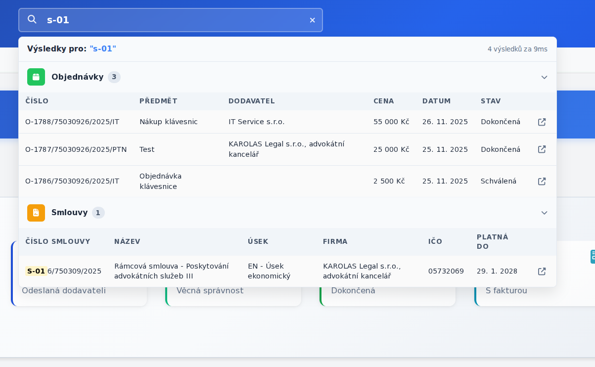
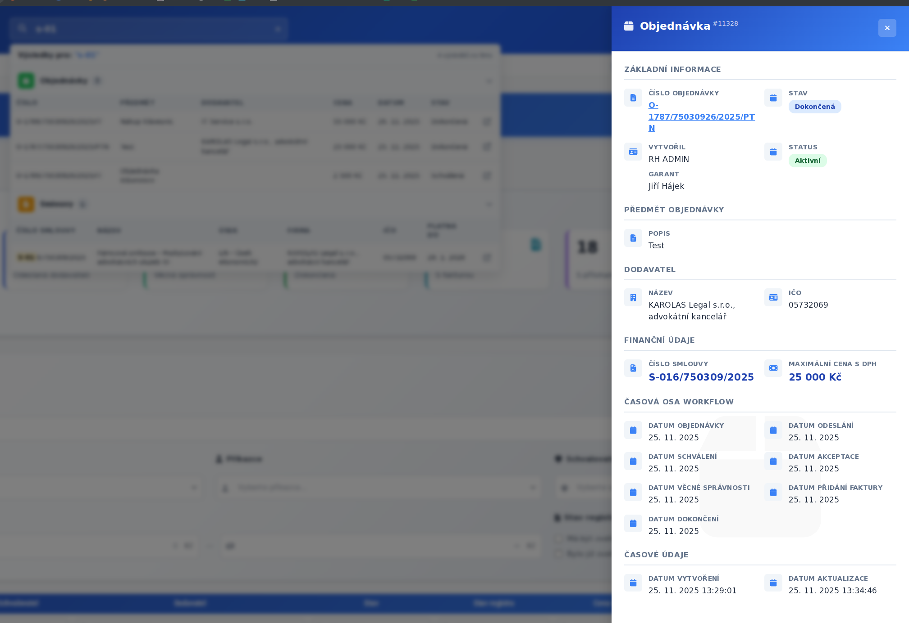
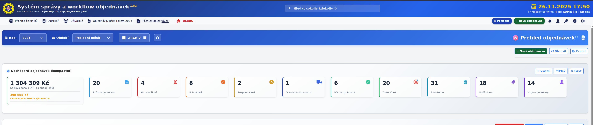
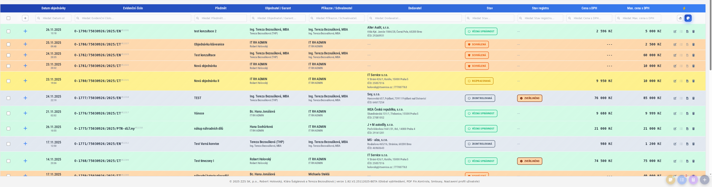
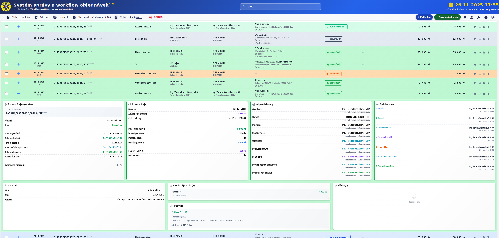
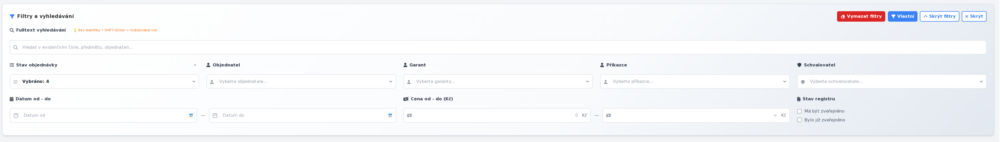

# 📋 Manuál - Přehled objednávek v systému EEO

## Obsah
1. [Úvod](#úvod)
2. [Globální vyhledávání](#globální-vyhledávání)
3. [Dashboard - Přehledové dlaždice](#dashboard---přehledové-dlaždice)
4. [Seznam objednávek](#seznam-objednávek)
5. [Filtrování objednávek](#filtrování-objednávek)
6. [Rozšířené filtry](#rozšířené-filtry)
7. [Detail objednávky](#detail-objednávky)
8. [Akce s objednávkami](#akce-s-objednávkami)
9. [Stránkování a export](#stránkování-a-export)
10. [Tipy a triky](#tipy-a-triky)

---

## 🎯 Úvod

Modul **Přehled objednávek** je centrálním místem pro správu a sledování všech objednávek v systému EEO. Nabízí pokročilé nástroje pro vyhledávání, filtrování a analýzu objednávek s intuitivním a přehledným rozhraním.

### Hlavní funkce:
- ✅ **Globální vyhledávání** napříč celou aplikací
- 📊 **Dashboard s přehledovými statistikami**
- 🔍 **Pokročilé filtrování** podle různých kritérií
- 📝 **Detailní zobrazení** každé objednávky
- 📤 **Export dat** do CSV formátu
- 🔐 **Oprávnění** pro různé úrovně přístupu

---

## 🔍 Globální vyhledávání

**Globální vyhledávání** je nejrychlejší způsob, jak najít objednávku, smlouvu, fakturu nebo kontakt v celém systému EEO.

### 📍 Kde najdu globální vyhledávání?

Vyhledávací pole najdete **v hlavičce aplikace** - je stále viditelné na každé stránce systému:



### 🎯 Co můžu hledat?

Globální vyhledávání prohledává:

#### **📋 Objednávky**
- Číslo objednávky (např. "2025/123")
- Předmět objednávky
- Poznámky
- Jméno objednatele
- Jméno garanta

#### **📄 Smlouvy**
- Číslo smlouvy
- Název smlouvy
- Dodavatel

#### **🧾 Faktury**
- Číslo faktury
- Variabilní symbol
- Dodavatel

#### **👥 Kontakty**
- Jméno uživatele
- E-mail
- Telefon
- Organizace

#### **🏢 Dodavatelé**
- Název firmy
- IČO
- E-mail
- Telefon

### ⚡ Jak používat globální vyhledávání?

1. **Klikněte** do vyhledávacího pole v hlavičce
2. **Začněte psát** hledaný výraz (minimálně 4 znaky)
3. **Počkejte chvíli** - systém automaticky začne hledat po 500ms
4. **Nebo stiskněte Enter** pro okamžité vyhledání

### 💡 Rychlé vyhledávání:

```
Tip: Pro okamžité vyhledání stiskněte Enter!
Systém jinak čeká 500ms, aby neztěžoval server při každém stisku klávesy.
```

### 📋 Výsledky vyhledávání

Po zadání hledaného výrazu se zobrazí **rozbalovací menu s výsledky**:



#### Struktura výsledků:

**Každý typ záznamu má svou sekci:**
- 📋 **Objednávky** - zobrazuje číslo, předmět a objednatele
- 📄 **Smlouvy** - číslo smlouvy, název, dodavatel
- 🧾 **Faktury** - číslo faktury, VS, dodavatel
- 👥 **Uživatelé** - jméno, e-mail, organizace
- 🏢 **Dodavatelé** - název, IČO, kontakt

#### Kliknutím na výsledek:
- Okamžitě se **otevře detail** vybraného záznamu
- U objednávek přejdete na **formulář objednávky**
- U faktur na **detail faktury**
- U kontaktů na **profil uživatele**

### ⚠️ Důležité poznámky:

```
⚡ Minimální délka: Zadejte alespoň 4 znaky
🔍 Hledání ignoruje diakritiku: můžete psát bez háčků a čárek
🌐 Prohledává celý systém: nejenom aktuální stránku
```

---

## 📊 Dashboard - Přehledové dlaždice

Po vstupu do sekce **Přehled objednávek** se zobrazí přehledový dashboard s důležitými statistikami.



### 📈 Zobrazované statistiky:

#### **🔢 Celkový počet objednávek**
- Počet všech objednávek za vybrané období
- Barevně zvýrazněný pro lepší přehlednost

#### **📋 Stavy objednávek**
Dashboard zobrazuje počty objednávek podle jejich stavu:

- **🆕 Nová** (modrá) - čeká na zpracování
- **⏳ Ke schválení** (oranžová) - čeká na schválení
- **✅ Schválená** (zelená) - schválená objednávka
- **⏰ Čeká se** (žlutá) - čeká na nějakou akci
- **🎯 Vyřízená** (šedá) - dokončená objednávka
- **❌ Stornovaná** (červená) - zrušená objednávka

#### **💰 Celková hodnota**
- Součet hodnot všech objednávek
- Zobrazeno v Kč s DPH

#### **📎 Další statistiky**
- **S položkami** - počet objednávek s vyplněnými položkami
- **S přílohami** - počet objednávek s připojenými dokumenty
- **Nevyřízené** - objednávky vyžadující akci

### 🎛️ Ovládání dashboardu:

#### **Klikací filtry**
Kliknutím na **jakoukoliv dlaždici** se seznam objednávek automaticky **vyfiltruje** podle vybraného kritéria.

```
Příklad: Klikněte na dlaždici "Ke schválení" 
→ zobrazí se pouze objednávky čekající na schválení
```

#### **Zrušení filtru**
- Klikněte **znovu na stejnou dlaždici** pro zrušení filtru
- Nebo použijte tlačítko **"Vymazat filtry"** v panelu filtrů

#### **Skrytí dashboardu**
Pro větší pracovní plochu můžete dashboard dočasně skrýt:
1. Klikněte na tlačítko **"Dashboard"** v ovládacím panelu
2. Dashboard se skryje a zobrazí se více místa pro seznam
3. Kliknutím znovu dashboard opět zobrazíte

---

## 📝 Seznam objednávek

Hlavní tabulka zobrazuje seznam všech objednávek s možností rozšířeného zobrazení.



### 📋 Sloupce tabulky:

| Sloupec | Popis |
|---------|-------|
| **📅 Datum** | Datum vytvoření objednávky |
| **🔢 Číslo** | Evidenční číslo objednávky |
| **📝 Předmět** | Stručný popis objednávky |
| **👤 Objednatel** | Jméno osoby, která objednávku vytvořila |
| **🎯 Stav** | Aktuální stav objednávky (barevný badge) |
| **💰 Cena s DPH** | Celková hodnota objednávky |
| **👨‍💼 Garant** | Osoba odpovědná za objednávku |
| **✅ Schvalovatel** | Osoba, která objednávku schválila |
| **⚙️ Akce** | Tlačítka pro editaci, náhled, smazání |

### 🎨 Barevné označení stavů:

Stavy objednávek jsou barevně rozlišeny pro rychlou orientaci:

- 🔵 **Modrá** - Nová objednávka
- 🟠 **Oranžová** - Ke schválení
- 🟢 **Zelená** - Schválená
- 🟡 **Žlutá** - Čeká se
- ⚪ **Šedá** - Vyřízená
- 🔴 **Červená** - Stornovaná

### 🔽 Rozbalení detailu:

Kliknutím na **šipku** (▶️) vlevo od objednávky se zobrazí **rozšířený detail** s více informacemi:



Rozbalený detail obsahuje:
- ✅ Kompletní informace o objednávce
- 💰 Podrobné cenové údaje
- 📅 Všechny časové údaje
- 👥 Všechny osoby spojené s objednávkou
- 📎 Seznam příloh
- 📦 Seznam položek objednávky

### ⚡ Rychlé akce:

#### **Řazení**
Klikněte na **hlavičku sloupce** pro seřazení:
- První klik: **vzestupně** ▲
- Druhý klik: **sestupně** ▼

#### **Rozbalit vše / Sbalit vše**
V ovládacím panelu najdete tlačítka pro:
- **Rozbalit všechny řádky** - zobrazí detaily všech objednávek najednou
- **Sbalit všechny řádky** - vrátí kompaktní zobrazení

---

## 🔍 Filtrování objednávek

Filtrování umožňuje rychle najít konkrétní objednávky podle různých kritérií.



### 🎯 Základní filtry:

#### **📅 Rok**
Vyberte rok, za který chcete zobrazit objednávky:
- Aktuální rok (výchozí)
- Předchozí roky
- **"Všechny roky"** - zobrazí objednávky za celou historii

#### **📆 Měsíc**
Volitelně upřesněte konkrétní měsíc:
- Pokud nevyberete, zobrazí se celý rok
- Kombinace rok + měsíc = přesné období

#### **🔍 Fulltextové vyhledávání**
Rychlé vyhledávání v aktuálním seznamu:
- Prohledává číslo objednávky
- Prohledává předmět
- Prohledává objednatele
- Prohledává poznámky

```
Tip: Toto vyhledávání je lokální - prohledává pouze 
aktuálně načtený seznam objednávek.
Pro vyhledávání v celém systému použijte globální vyhledávání v hlavičce!
```

### 🔧 Zobrazení/skrytí filtrů:

V ovládacím panelu nahoře najdete tlačítko **"Filtr"**:
- Kliknutím **zobrazíte** nebo **skryjete** panel s pokročilými filtry
- Uvolníte tak více místa pro seznam objednávek

---

## 🔬 Rozšířené filtry

Rozšířené filtry nabízejí detailnější možnosti filtrování podle více kritérií najednou.

### 📊 Dostupné rozšířené filtry:

#### **👤 Filtr podle objednatele**
- Dropdown se seznamem všech uživatelů
- Možnost vybrat **více osob najednou**
- Zobrazí pouze objednávky vybraných objednatelů

#### **👨‍💼 Filtr podle garanta**
- Seznam garantů z databáze
- **Vícenásobný výběr** podporován
- Filtruje objednávky podle odpovědné osoby

#### **✅ Filtr podle schvalovatele**
- Dropdown s možnými schvalovateli
- Vyberte osobu, která objednávku schválila

#### **🎯 Filtr podle stavu**
Vyberte jeden nebo více stavů:
- ☑️ Nová
- ☑️ Ke schválení
- ☑️ Schválená
- ☑️ Čeká se
- ☑️ Vyřízená
- ☑️ Stornovaná

#### **📅 Datumový filtr**
Upřesněte časové období:
- **Od data** - začátek období
- **Do data** - konec období
- Formát: DD.MM.RRRR

#### **💰 Cenový filtr**
Najděte objednávky v určeném cenovém rozmezí:
- **Od částky** - minimální hodnota
- **Do částky** - maximální hodnota
- Částky v Kč s DPH

### 🎛️ Kombinování filtrů:

```
💡 Všechny filtry lze kombinovat!

Příklad: Zobrazit objednávky
- Od garanta "Jan Novák"
- Se stavem "Ke schválení"
- Za měsíc únor 2025
- V rozmezí 10 000 - 50 000 Kč
```

### 🧹 Vymazání filtrů:

Pro rychlé zrušení všech aktivních filtrů:
1. Klikněte na tlačítko **"Vymazat filtry"**
2. Všechny filtry se resetují na výchozí hodnoty
3. Zobrazí se kompletní seznam objednávek

---

## 📋 Detail objednávky

Rozbalený detail objednávky poskytuje kompletní přehled o všech aspektech objednávky.


### 📑 Sekce detailu:

#### **📌 Základní informace**
```
ID objednávky:        123
Evidenční číslo:      2025/045
Předmět:              Kancelářské potřeby pro Q1/2025
Poznámka:             Urgentní dodání do konce měsíce
```

#### **👥 Osoby**
```
Objednatel:           Ing. Jana Nováková
                      (jana.novakova@example.cz, +420 123 456 789)

Garant:               Mgr. Petr Svoboda
                      (petr.svoboda@example.cz, +420 234 567 890)

Schvalovatel:         Prof. Marie Dvořáková
                      (marie.dvorakova@example.cz)

Vytvořil:             Jana Nováková
```

#### **💰 Cenové údaje**
```
Cena bez DPH:         42 000 Kč
DPH (21%):            8 820 Kč
─────────────────────────────
Cena s DPH:           50 820 Kč
```

#### **📅 Časové údaje**
```
Datum vytvoření:      15.01.2025 14:30
Datum úpravy:         18.01.2025 09:15
Termín dodání:        31.01.2025
```

#### **🎯 Stav objednávky**
```
Aktuální stav:        ✅ Schválená
Datum schválení:      17.01.2025 16:45
```

#### **📦 Položky objednávky**
Tabulka s jednotlivými položkami:

| Položka | Množství | Jedn. cena | Celkem |
|---------|----------|------------|--------|
| Papír A4 | 50 bal. | 120 Kč | 6 000 Kč |
| Toner černý | 5 ks | 1 200 Kč | 6 000 Kč |
| Flash disk 32GB | 20 ks | 350 Kč | 7 000 Kč |

#### **📎 Přílohy**
Seznam připojených dokumentů:
- 📄 Nabídka_dodavatel.pdf (245 KB)
- 📊 Specifikace_pozadavku.xlsx (18 KB)
- 📋 Schvaleni_vedeni.pdf (156 KB)

Každou přílohu lze **stáhnout** kliknutím na její název.

---

## ⚙️ Akce s objednávkami

V každém řádku seznamu najdete tlačítka pro různé akce s objednávkou.

### 🔨 Dostupné akce:

#### **✏️ Editovat**
- Otevře **formulář objednávky** v režimu editace
- K dispozici pro:
  - ✅ Vlastní objednávky (všichni uživatelé)
  - ✅ Všechny objednávky (uživatelé s oprávněním `ORDER_EDIT_ALL`)

**Postup:**
1. Klikněte na ikonu **tužky** (✏️)
2. Otevře se formulář objednávky
3. Proveďte změny
4. Uložte tlačítkem **"Uložit"**

```
⚠️ Upozornění: Systém kontroluje, zda není objednávka 
uzamčena jiným uživatelem!
```

#### **👁️ Náhled**
- Zobrazí **detail objednávky** v režimu pouze pro čtení
- K dispozici pro všechny uživatele
- Vhodné pro rychlou kontrolu bez rizika změn

#### **🗑️ Smazat**
- Vymaže objednávku z databáze
- K dispozici pouze pro uživatele s oprávněním `ORDER_MANAGE`
- Systém požádá o **potvrzení** před smazáním

**Bezpečnostní otázka:**
```
Opravdu chcete smazat objednávku č. 2025/045?
Tato akce je nevratná!

[Ano, smazat]  [Zrušit]
```

### 🔐 Oprávnění:

Přístup k akcím se řídí **uživatelskými právy**:

| Oprávnění | Co umožňuje |
|-----------|-------------|
| `ORDER_EDIT_OWN` | Editovat vlastní objednávky |
| `ORDER_EDIT_ALL` | Editovat všechny objednávky |
| `ORDER_MANAGE` | Mazat objednávky, pokročilá správa |
| `ORDER_VIEW` | Pouze prohlížet objednávky |

---

## 📄 Stránkování a export

Pro práci s větším množstvím objednávek jsou k dispozici nástroje pro stránkování a export dat.

### 📖 Stránkování:

**Ovládání stránkování** najdete **pod seznamem** objednávek:

```
Zobrazeno: 1-25 z 348 záznamů

[◀◀ První] [◀ Předchozí] [Stránka 1 z 14] [Následující ▶] [Poslední ▶▶]
```

#### **Změna počtu záznamů na stránku:**
Vyberte z dostupných možností:
- 📄 **10** záznamů (rychlý přehled)
- 📄 **25** záznamů (výchozí)
- 📄 **50** záznamů
- 📄 **100** záznamů (detailní analýza)
- 📄 **250** záznamů (pro export)

```
💡 Tip: Pro práci s velkým množstvím dat zvolte 100 nebo 250 záznamů,
pak použijte fulltextové vyhledávání (Ctrl+F v prohlížeči) 
pro rychlé nalezení konkrétního údaje.
```

#### **Navigace mezi stránkami:**
- **První** - přeskočí na první stránku
- **Předchozí** - posun o jednu stránku zpět
- **Následující** - posun o jednu stránku vpřed
- **Poslední** - přeskočí na poslední stránku

### 📤 Export do CSV:

Export umožňuje stáhnout aktuálně filtrovaný seznam do souboru CSV (Excel).

**Postup exportu:**
1. Nastavte požadované **filtry** (rok, měsíc, stav, atd.)
2. Klikněte na tlačítko **"Export"** ⬇️
3. Systém vygeneruje CSV soubor
4. Soubor se automaticky **stáhne** do vašeho počítače

**Název souboru:**
```
objednavky_2025_export.csv
```

**Obsah exportu:**
- ✅ Všechny sloupce tabulky
- ✅ Pouze **filtrované** záznamy
- ✅ Formát kompatibilní s **Microsoft Excel**
- ✅ Kódování UTF-8 (správné zobrazení českých znaků)

**Import do Excelu:**
1. Otevřete Excel
2. Vyberte **Data → Ze souboru → Z textu/CSV**
3. Vyberte stažený soubor
4. Excel automaticky rozpozná formát

---

## 💡 Tipy a triky

### ⚡ Rychlé klávesové zkratky:

```
Ctrl + F          Vyhledávání v aktuální stránce
Enter             Okamžité globální vyhledávání
Esc               Zavření dropdownu s výsledky
Tab               Přechod mezi filtry
```

### 🎯 Efektivní práce s filtry:

#### **Oblíbené kombinace filtrů:**

**1. Moje nedokončené objednávky:**
```
Filtr: Objednatel = [můj účet]
Stav: Nová, Ke schválení, Čeká se
```

**2. Urgentní objednávky k jednání:**
```
Stav: Ke schválení
Datum do: [dnešní datum + 3 dny]
```

**3. Velké objednávky za aktuální měsíc:**
```
Rok: 2025
Měsíc: [aktuální měsíc]
Částka od: 100 000 Kč
```

### 🔍 Tipy pro vyhledávání:

#### **Globální vyhledávání:**
- ✅ **Funkčí bez diakritiky** - můžete psát "Novak" místo "Novák"
- ✅ **Hledá ve všech polích** - číslo, předmět, poznámky, osoby
- ✅ **Enter = rychlé vyhledání** - nemusíte čekat na automatické hledání

#### **Lokální fulltextové vyhledávání:**
- ✅ Rychlé pro **aktuálně zobrazený seznam**
- ✅ Nezatěžuje server
- ✅ Ideální pro **filtrování v již načtených datech**

```
🎯 Pravidlo: 
- Hledáte konkrétní objednávku nebo kontakt? → Globální vyhledávání
- Filtrujete v aktuálním seznamu? → Lokální fulltextové vyhledávání
```

### 📊 Práce s dashboardem:

#### **Rychlá analýza:**
1. Nastavte **období** (rok + měsíc)
2. Zkontrolujte **dashboard**
3. Identifikujte **problémové oblasti** (např. mnoho objednávek "Ke schválení")
4. Klikněte na **příslušnou dlaždici**
5. Pracujte s **vyfiltrovaným seznamem**

### 🎨 Vizuální pomůcky:

#### **Barevné kódování stavů:**
Naučte se rychle rozpoznávat stavy podle barev:
- 🔵 **Modrá** = nová činnost
- 🟠 **Oranžová** = vyžaduje pozornost
- 🟢 **Zelená** = vše v pořádku
- 🔴 **Červená** = problém nebo zrušeno

### 🔄 Automatická aktualizace:

Systém **automaticky aktualizuje** data při:
- ✅ Přepnutí na jinou záložku a zpět
- ✅ Změně filtru
- ✅ Po uložení změn v objednávce
- ✅ Po obdržení notifikace o změně

### 📱 Mobilní použití:

Pro práci na mobilních zařízeních:
- ✅ Skryjte **dashboard** pro více místa
- ✅ Skryjte **panel filtrů** když nepotřebujete
- ✅ Použijte **globální vyhledávání** místo scrollování
- ✅ Rozbalujte detail **jen u potřebných objednávek**

---

## 🆘 Časté problémy a řešení

### ❓ Nenacházím svou objednávku

**Možné příčiny:**
1. **Aktivní filtr** - zkontrolujte nastavené filtry
2. **Špatné období** - změňte rok nebo měsíc
3. **Objednávka archivována** - zapněte zobrazení archivovaných

**Řešení:**
1. Klikněte na **"Vymazat filtry"**
2. Nastavte **"Všechny roky"**
3. Použijte **globální vyhledávání** v hlavičce

### ❓ Nemůžu editovat objednávku

**Možné příčiny:**
1. **Chybí oprávnění** - nemáte právo editovat tuto objednávku
2. **Uzamčená objednávka** - edituje ji jiný uživatel
3. **Archivovaná objednávka** - archivované nelze editovat

**Řešení:**
- Kontaktujte **garanta** nebo **administrátora**
- Počkejte, až jiný uživatel dokončí editaci
- Objednejte **odemčení** od příslušné osoby

### ❓ Export nefunguje

**Možné příčiny:**
1. **Blokování pop-up** v prohlížeči
2. **Příliš velký dataset** - timeout serveru
3. **Chyba oprávnění**

**Řešení:**
1. Povolte pop-up okna pro aplikaci EEO
2. Zužte filtry na menší množství dat
3. Kontaktujte IT podporu

---

## 📞 Potřebujete pomoc?

### 🛠️ Technická podpora

V případě technických problémů kontaktujte:

**IT podpora:**
- 📧 E-mail: it.podpora@example.cz
- 📞 Telefon: +420 123 456 789
- 💬 Chat: dostupný v aplikaci EEO

**Pracovní doba:**
- Pondělí - Pátek: 8:00 - 16:00

### 📚 Další zdroje

- **Kompletní dokumentace:** [docs/USER_MANUAL.md](./USER_MANUAL.md)
- **Video tutoriály:** [manualy/videa/](./videa/)
- **FAQ:** [docs/FAQ.md](./FAQ.md)

---

## 🎓 Závěr

Nyní byste měli být schopni:
- ✅ Používat **globální vyhledávání** pro rychlé nalezení záznamů
- ✅ Orientovat se v **dashboardu** a statistikách
- ✅ **Filtrovat objednávky** podle různých kritérií
- ✅ Zobrazit **detail objednávky** a pracovat s ním
- ✅ Provádět **základní akce** s objednávkami
- ✅ **Exportovat data** do CSV formátu

```
💡 Tip na závěr:
Čím více budete aplikaci používat, tím rychlejší a efektivnější budete.
Nebojte se experimentovat - všechny důležité akce vyžadují potvrzení!
```

---

**Verze manuálu:** 1.0  
**Datum vydání:** 26. listopadu 2025  
**Platnost pro verzi aplikace:** EEO 3.x

---

**© 2025 EEO System - Elektronická evidence objednávek**
