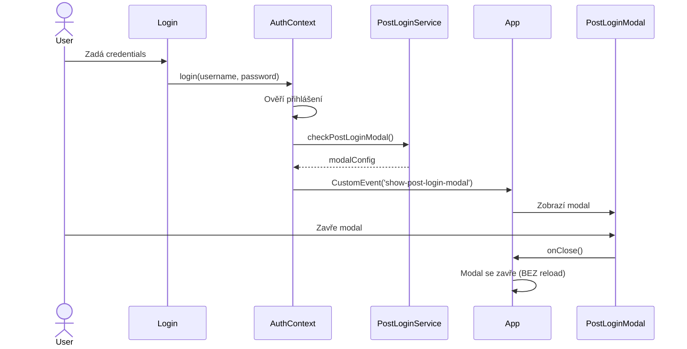
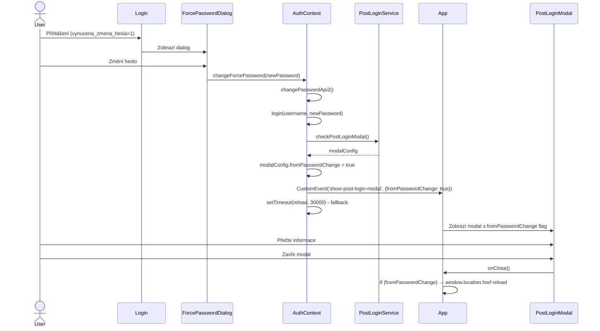

# Post-Login Dialog After Forced Password Change

**Datum vytvoření:** 5. ledna 2026  
**Autor:** GitHub Copilot  
**Status:** ✅ Implementováno

## 📋 Obsah

1. [Úvod](#úvod)
2. [Problém](#problém)
3. [Řešení](#řešení)
4. [Implementace](#implementace)
5. [Flow diagramy](#flow-diagramy)
6. [Testování](#testování)

---

## 🎯 Úvod

Po vynucené změně hesla (forced password change) se uživatel přihlásí do systému s novým heslem. V tomto okamžiku je důležité zobrazit **post-login dialog** (uvítací zprávu, důležitá upozornění, novinky apod.), který se normálně zobrazuje při běžném přihlášení.

### Požadavek uživatele

> "ted bych potreboval postlogin dialog tak mame vynucena zmena hesla, a po zmene ho to posled do aplikace, ale ja bych potreboval po nucena zmene hesla aby se zobrazil tento post login take"

**Překlad:** Po nucené změně hesla zobrazit post-login dialog před vstupem do aplikace.

---

## 🔴 Problém

### Původní flow

```
1. Uživatel se přihlásí s heslem, které má příznak vynucena_zmena_hesla = 1
2. Zobrazí se ForcePasswordChangeDialog
3. Uživatel změní heslo
4. changeForcePassword() funkce:
   - Změní heslo přes API
   - Zavolá login() s novým heslem
   - Provede window.location.href reload
5. ❌ Post-login modal se NEZOBRAZÍ, protože reload přerušil proces
```

### Proč nefungoval post-login modal?

- `login()` funkce v AuthContext.js obsahuje logiku pro zobrazení post-login modalu
- Modal se spouští přes `setTimeout(..., 1000)` - asynchronně po 1 sekundě
- `changeForcePassword()` ihned volá `window.location.href = '/'` po `login()`
- **Důsledek:** Reload stránky se provede DŘÍVE, než se modal stihne zobrazit

---

## ✅ Řešení

### Nový flow

```
1. Uživatel se přihlásí s vynucena_zmena_hesla = 1
2. Zobrazí se ForcePasswordChangeDialog
3. Uživatel změní heslo
4. changeForcePassword() funkce:
   - Změní heslo přes API
   - Zavolá login() s novým heslem
   - ✅ NOVĚ: Zkontroluje a zobrazí post-login modal
   - Přidá flag fromPasswordChange = true
   - Odešle custom event 'show-post-login-modal'
   - Nastaví fallback reload za 30 sekund
5. App.js zachytí event a zobrazí PostLoginModal
6. Uživatel přečte modal a zavře jej
7. ✅ handleClosePostLoginModal() detekuje fromPasswordChange flag
8. ✅ Provede reload aplikace (window.location.href)
```

### Klíčové změny

1. **Flag `fromPasswordChange`**: Přidán do state a event payload
2. **Odložený reload**: Místo okamžitého reloadu se čeká na zavření modalu
3. **Fallback mechanismus**: Pokud uživatel modal nezavře, reload se provede za 30s

---

## 🔧 Implementace

### 1. AuthContext.js - changeForcePassword()

**Soubor:** `/var/www/erdms-dev/apps/eeo-v2/client/src/context/AuthContext.js`

**Změny:**

```javascript
// 🔑 Funkce pro změnu hesla při vynuceném heslu  
const changeForcePassword = async (newPassword) => {
  // ... validace ...
  
  try {
    const result = await changePasswordApi2({ ... });
    
    if (result.success || result.token) {
      setTempToken(null);
      await login(username, newPassword);
      
      // 🔔 POST-LOGIN MODAL: Po změně hesla zobrazit modal PŘED reload
      console.log('🔔 Kontroluji post-login modal po změně hesla...');
      try {
        const { checkPostLoginModal } = await import('../services/postLoginModalService');
        const modalConfig = await checkPostLoginModal(
          user.id,
          result.token || token,
          username
        );
        
        if (modalConfig && modalConfig.enabled) {
          console.log('✅ Post-login modal bude zobrazen po změně hesla');
          
          // 🔑 Přidat flag, že modal přišel po změně hesla
          modalConfig.fromPasswordChange = true;
          
          // Vyvolat custom event - App.js ho zachytí a zobrazí modal
          if (typeof window !== 'undefined') {
            window.dispatchEvent(new CustomEvent('show-post-login-modal', {
              detail: modalConfig
            }));
          }
          
          // ⏱️ ODLOŽENÝ RELOAD: Fallback po 30 sekundách
          setTimeout(() => {
            console.log('🔄 Fallback reload po 30s - pokud uživatel nezavřel modal');
            const basePath = process.env.PUBLIC_URL || '/eeo-v2';
            window.location.href = basePath + '/';
          }, 30000);
          
          return; // DŮLEŽITÉ: Nekončit funkci, modal je zobrazen
        }
      } catch (modalError) {
        console.warn('⚠️ Chyba při kontrole post-login modal:', modalError);
      }
      
      // Pokud modal není k dispozici, provést normální reload
      setTimeout(() => {
        const basePath = process.env.PUBLIC_URL || '/eeo-v2';
        window.location.href = basePath + '/';
      }, 500);
    }
  } catch (error) {
    console.error('❌ Chyba při vynucené změně hesla:', error);
    throw error;
  }
};
```

**Řádky změny:** 910-1007

---

### 2. App.js - State management

**Soubor:** `/var/www/erdms-dev/apps/eeo-v2/client/src/App.js`

**Změny v state:**

```javascript
// 🔔 POST-LOGIN MODAL: State pro modal dialog po přihlášení
const [postLoginModal, setPostLoginModal] = React.useState({
  isOpen: false,
  config: null,
  fromPasswordChange: false // 🔑 Flag pokud modal přišel po změně hesla
});
```

**Řádek změny:** ~276-280

---

### 3. App.js - Event handler

**Změny v handlePostLoginModal:**

```javascript
// 🔔 Post-login modal handler
useEffect(() => {
  const handlePostLoginModal = (event) => {
    const modalConfig = event.detail;
    
    if (modalConfig && modalConfig.enabled) {
      setPostLoginModal({
        isOpen: true,
        config: modalConfig,
        fromPasswordChange: modalConfig.fromPasswordChange || false // 🔑 Zachytit flag
      });
    }
  };

  window.addEventListener('show-post-login-modal', handlePostLoginModal);
  return () => window.removeEventListener('show-post-login-modal', handlePostLoginModal);
}, []);
```

**Řádky změny:** ~360-375

---

### 4. App.js - Close handler s reload

**Změny v handleClosePostLoginModal:**

```javascript
// 🔔 POST-LOGIN MODAL: Handler funkce
const handleClosePostLoginModal = async () => {
  const wasFromPasswordChange = postLoginModal.fromPasswordChange;
  
  setPostLoginModal({
    isOpen: false,
    config: null,
    fromPasswordChange: false
  });
  
  // 🔄 RELOAD po zavření modalu pokud přišel po změně hesla
  if (wasFromPasswordChange) {
    console.log('🔄 Modal zavřen po změně hesla - provádím reload aplikace');
    setTimeout(() => {
      const basePath = process.env.PUBLIC_URL || '/eeo-v2';
      window.location.href = basePath + '/';
    }, 300); // Krátké zpoždění pro hladší přechod
  }
};
```

**Řádky změny:** ~489-506

---

## 📊 Flow diagramy

### Běžné přihlášení (post-login modal)



### Nový flow: Forced password change + post-login modal



---

## 🧪 Testování

### Test scénář 1: Forced password change s aktivním post-login modal

**Preconditions:**
- Uživatel má nastaveno `vynucena_zmena_hesla = 1` v databázi
- Post-login modal je aktivní (`post_login_modal_enabled = 1`)
- Uživatel ještě neviděl modal (localStorage nemá záznam)

**Kroky:**
1. Přihlásit se s uživatelem, který má `vynucena_zmena_hesla = 1`
2. Zobrazí se ForcePasswordChangeDialog
3. Zadat nové heslo a potvrdit
4. ✅ **Očekávaný výsledek:** Zobrazí se PostLoginModal
5. Zavřít modal tlačítkem "Zavřít" (X)
6. ✅ **Očekávaný výsledek:** Aplikace se reloadne (window.location.href)

**Verifikace:**
- Console log: `🔔 Kontroluji post-login modal po změně hesla...`
- Console log: `✅ Post-login modal bude zobrazen po změně hesla`
- Console log: `🔄 Modal zavřen po změně hesla - provádím reload aplikace`

---

### Test scénář 2: Forced password change BEZ aktivního post-login modal

**Preconditions:**
- Uživatel má nastaveno `vynucena_zmena_hesla = 1`
- Post-login modal je **NEAKTIVNÍ** (`post_login_modal_enabled = 0`)

**Kroky:**
1. Přihlásit se s uživatelem
2. Zobrazí se ForcePasswordChangeDialog
3. Zadat nové heslo a potvrdit
4. ✅ **Očekávaný výsledek:** Modal se NEZOBRAZÍ
5. ✅ **Očekávaný výsledek:** Aplikace se reloadne po 500ms

**Verifikace:**
- Console log: `ℹ️ Post-login modal není k dispozici, pokračuji s reload`

---

### Test scénář 3: Fallback reload po 30 sekundách

**Preconditions:**
- Stejné jako Test scénář 1

**Kroky:**
1. Přihlásit se a změnit heslo
2. PostLoginModal se zobrazí
3. **NEZAVÍRAT modal** - čekat 30 sekund
4. ✅ **Očekávaný výsledek:** Po 30 sekundách se aplikace automaticky reloadne

**Verifikace:**
- Console log: `🔄 Fallback reload po 30s - pokud uživatel nezavřel modal`

---

### Test scénář 4: "Příště nezobrazovat" + reload

**Preconditions:**
- Stejné jako Test scénář 1

**Kroky:**
1. Přihlásit se a změnit heslo
2. PostLoginModal se zobrazí
3. Kliknout na "Příště nezobrazovat"
4. ✅ **Očekávaný výsledek:** 
   - Modal se zavře
   - localStorage uloží `dismissed_post_login_modal_{username}_{guid}`
   - Aplikace se reloadne

**Verifikace:**
- Console log: `🔄 Modal zavřen po změně hesla - provádím reload aplikace`
- localStorage obsahuje klíč pro dismissed modal

---

## 📝 Poznámky

### Proč reload?

Po změně hesla je nutné provést **full page reload** z těchto důvodů:

1. **Čistý stav aplikace**: Zajistit, že všechny komponenty a state se správně inicializují s novým tokenem
2. **Token refresh**: Backend vrací nový token po změně hesla
3. **UserDetail refresh**: Zajistit, že `vynucena_zmena_hesla` flag je aktualizovaný (změněn na 0)
4. **Cache clear**: Vyčistit všechny cache data z předchozí session

### Proč 30s fallback?

- Uživatel může zapomenout zavřít modal
- Technické problémy s event handlerem
- Bezpečnostní opatření - zajistit reload i při neočekávaných chybách

### Proč 300ms delay před reload?

- Hladší UX přechod
- Dát čas DOM aktualizovat state před reload
- Uživatel vidí potvrzení o zavření modalu

---

## ✅ Závěr

Implementace zajišťuje, že uživatelé po vynucené změně hesla uvidí důležité post-login informace před vstupem do aplikace. Systém je robustní s fallback mechanismy pro různé edge case scénáře.

### Výhody řešení

- ✅ Konzistentní UX - post-login modal se zobrazí vždy
- ✅ Bezpečné - reload zajišťuje čistý stav
- ✅ Robustní - fallback mechanismy pro edge cases
- ✅ Flexibilní - flag systém umožňuje různé flow
- ✅ Debugovatelné - detailní console logy

### Soubory změněny

1. `/var/www/erdms-dev/apps/eeo-v2/client/src/context/AuthContext.js`
   - Funkce `changeForcePassword()` - přidán post-login modal check
   - Přidán flag `fromPasswordChange` do event payload

2. `/var/www/erdms-dev/apps/eeo-v2/client/src/App.js`
   - State `postLoginModal` - přidán `fromPasswordChange` flag
   - Event handler - zachycení `fromPasswordChange` flag
   - Close handler - reload po zavření pokud `fromPasswordChange === true`
