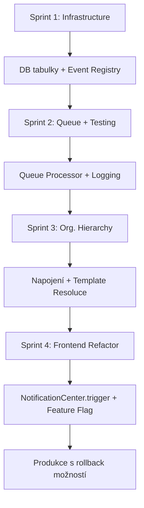

# Centrální Notifikační Centrum - Analýza a Návrh

**Datum:** 14. prosince 2025  
**Verze:** 1.0  
**Status:** DRAFT - Připraveno k diskuzi

---

## 📋 EXECUTIVE SUMMARY

Tento dokument analyzuje současný stav notifikačního systému v ERDMS a navrhuje architekturu **centrálního notifikačního centra**, které sjednotí a zefektivní zasílání všech typů notifikací v aplikaci.

### Klíčové cíle:
1. ✅ Sjednocení notifikačních kanálů (email, in-app, SMS, push)
2. ✅ Centralizace logiky pro šablony a varianty
3. ✅ Podpora workflow-based notifikací definovaných v org. hierarchii
4. ✅ Real-time notifikace s queue systémem
5. ✅ Audit trail a monitoring doručení

---

## 🔍 SOUČASNÝ STAV - ANALÝZA

### 1. Organizační Hierarchie - Notifikační Workflow

#### Aktuální Implementace v `OrganizationHierarchy.js`

**Struktura NODE (Template):**
```javascript
{
  type: 'template',
  templateId: number,
  name: string,
  data: {
    normalVariant: string,      // HTML šablona pro normální stav (🟠)
    urgentVariant: string,       // HTML šablona pro urgentní stav (🔴)
    infoVariant: string,         // HTML šablona pro info oznámení (🟢)
    previewVariant: string       // Aktuálně zobrazená varianta v náhledu
  }
}
```

**Struktura EDGE (Connection):**
```javascript
{
  source: nodeId,
  target: nodeId,
  data: {
    notifications: {
      email: boolean,            // Posílat email?
      inapp: boolean,            // Zobrazit in-app notifikaci?
      recipientRole: string,     // 'APPROVAL' | 'INFO' | 'BOTH'
      types: []                  // Typy událostí (TODO)
    },
    scope: 'OWN' | 'TEAM' | 'LOCATION' | 'ALL',
    modules: {
      orders: boolean,
      invoices: boolean,
      contracts: boolean,
      cashbook: boolean
    }
  }
}
```

#### Současné Problémy:

1. ❌ **Chybí definice událostí (events)**
   - NODE definuje šablony, ale nejsou navázané na konkrétní události
   - Není jasné, kdy se má použít normalVariant vs urgentVariant vs infoVariant

2. ❌ **Neúplná logika recipient role**
   - `recipientRole` je v EDGE, ale backend neví, jak to použít
   - Chybí mapování: kdy je někdo SCHVALOVATEL vs AUTOR

3. ❌ **Žádné propojení s backend workflow**
   - Frontend definuje strukturu, ale backend nemá API pro vyhodnocení
   - Není endpoint pro "pošli notifikaci podle hierarchie"

4. ❌ **Duplicitní data mezi nodes a edges**
   - Template varianty jsou v NODE.data
   - Ale vztahy jsou v EDGE.data
   - Při ukládání se musí synchronizovat

5. ❌ **Chybí event typing system**
   - Jaké události systém podporuje?
   - Objednávka vytvořena / schválena / zamítnuta / urgentní?
   - Faktura vytvořena / splatná / po splatnosti?

---

## 🔄 REFERENČNÍ WORKFLOW - KOMPLETNÍ OBJEDNÁVKA

### Příklad: Životní cyklus objednávky s notifikacemi

```
FÁZE 1: VYTVOŘENÍ
  Robert (Objednatel) → Vytvoří požadavek
  EVENT: ORDER_CREATED
  ├─► Příkazce → 🔴 EXCEPTIONAL "Schvalte objednávku"
  ├─► Garant → 🟠 APPROVAL "Nová objednávku"
  └─► Robert → 🟢 INFO "Odesláno ke schválení"

FÁZE 2A: SCHVÁLENÍ
  Příkazce → Schválí
  EVENT: ORDER_APPROVED
  ├─► Robert → 🟠 APPROVAL "Schváleno - pokračuj!"
  ├─► Garant → 🟢 INFO "Schváleno"
  └─► Příkazce → 🟢 INFO "Schválení odesláno"

FÁZE 2B: ZAMÍTNUTÍ
  Příkazce → Zamítne
  EVENT: ORDER_REJECTED
  ├─► Robert → 🔴 EXCEPTIONAL "Zamítnuto!"
  ├─► Garant → 🟢 INFO "Zamítnuto"
  └─► Příkazce → 🟢 INFO "Zamítnutí odesláno"
  ❌ PROCES KONČÍ

FÁZE 2C: VRÁCENÍ K DOPLNĚNÍ
  Příkazce → Vrátí k doplnění
  EVENT: ORDER_WAITING_FOR_CHANGES
  ├─► Robert → 🟠 APPROVAL "Vráceno - doplň!"
  ├─► Garant → 🟠 APPROVAL "Vráceno k doplnění"
  └─► Příkazce → 🟢 INFO "Notifikace odeslána"

FÁZE 3: ODESLÁNÍ DODAVATELI
  Robert → Odešle dodavateli
  EVENT: ORDER_SENT_TO_SUPPLIER
  ├─► Role: Nákupčí → 🟠 APPROVAL "Odeslána dodavateli"
  ├─► Garant → 🟢 INFO "Odeslána dodavateli"
  ├─► Příkazce → 🟢 INFO "Odeslána dodavateli"
  └─► Robert → 🟢 INFO "Úspěšně odesláno"

FÁZE 4: ŽÁDOST O REGISTR
  Robert → Žádá o schválení v registru
  EVENT: ORDER_REGISTRY_APPROVAL_REQUESTED
  ├─► Role: Registr IT → 🔴 EXCEPTIONAL "Schvalte registr!"
  ├─► Garant → 🟢 INFO "Žádost o registr"
  └─► Robert → 🟢 INFO "Žádost odeslána"

FÁZE 5: DOPLNĚNÍ FAKTURY
  Role: Registr IT → Doplní fakturu
  EVENT: ORDER_INVOICE_ADDED
  ├─► Robert → 🟠 APPROVAL "Proveď věcnou kontrolu!"
  ├─► Garant → 🟢 INFO "Faktura doplněna"
  └─► Role: Registr → 🟢 INFO "Notifikace odeslána"

FÁZE 6: VĚCNÁ KONTROLA
  Robert → Provede kontrolu
  EVENT: ORDER_MATERIAL_CHECK_COMPLETED
  ├─► Role: Registr IT → 🟠 APPROVAL "Dokonči objednávku!"
  ├─► Garant → 🟢 INFO "Kontrola provedena"
  └─► Robert → 🟢 INFO "Kontrola odeslána"

FÁZE 7: DOKONČENÍ
  Role: Registr IT → Dokončí
  EVENT: ORDER_COMPLETED
  ├─► Robert → 🟢 INFO "Dokončeno"
  ├─► Garant → 🟢 INFO "Dokončeno"
  ├─► Příkazce → 🟢 INFO "Dokončeno"
  └─► Role: Registr → 🟢 INFO "Úspěšně dokončeno"
  ✅ PROCES KONČÍ
```

**💡 Klíčové poznatky:**
- Každá fáze = 1 událost (EVENT)
- Každý příjemce má svou roli (EXCEPTIONAL/APPROVAL/INFO)
- recipientRole určuje **TYP notifikace**, ne akci
- Pokud EDGE v org. hierarchii neexistuje → notifikace se NEPOSÍLÁ
- Template NODE obsahuje 3 varianty šablon (🔴🟠🟢)

---

## 🎨 recipientRole - FINÁLNÍ DEFINICE

### Co `recipientRole` OPRAVDU znamená:

**NENÍ to:**
- ❌ "Musíš kliknout na tlačítko Potvrdit/Schválit"
- ❌ "Vyžaduje akci od uživatele"
- ❌ Workflow tlačítko ve formuláři

**JE to:**
- ✅ **Typ/priorita notifikace** (důležitá vs informační)
- ✅ **Barva/vizuál** ve zvonečku (🔴 červená vs 🟠 oranžová vs 🟢 zelená)
- ✅ **Kontext pro příjemce** ("karta je u tebe" vs "jen pro info")
- ✅ **Výběr šablony** (urgentVariant vs normalVariant vs infoVariant)

---

### 3 Hodnoty recipientRole:

```javascript
// === EXCEPTIONAL - Mimořádná událost ===
recipientRole: 'EXCEPTIONAL'
Šablona: 🔴 urgentVariant
Použití: Příkazce MUSÍ schválit, Registr MUSÍ schválit
Příklad: "SCHVALTE objednávku #2025-001 IHNED!"
Význam: Kritická akce - karta je u příjemce, mimořádná událost

// === APPROVAL - Důležitá notifikace ===
recipientRole: 'APPROVAL'  
Šablona: 🟠 normalVariant
Použití: Objednatel dostane info, že může pokračovat
Příklad: "Objednávka vrácena - karta je u tebe, pokračuj!"
Význam: Důležitá notifikace - karta/úkol je u příjemce, může pokračovat

// === INFO - Informační notifikace ===
recipientRole: 'INFO'
Šablona: 🟢 infoVariant
Použití: Autor akce dostane potvrzení, že akce proběhla
Příklad: "Notifikace odeslána objednateli Robert Holovský"
Význam: Jen pro vědomí - akce dokončena, žádná další akce potřebná
```

---

### Praktické příklady podle workflow:

| Fáze | Kdo | recipientRole | Šablona | Text |
|------|-----|---------------|---------|------|
| Vytvoření | Příkazce | `EXCEPTIONAL` | 🔴 | "Schvalte obj!" |
| Schváleno | Robert | `APPROVAL` | 🟠 | "Schváleno - pokračuj!" |
| Schváleno | Příkazce | `INFO` | 🟢 | "Schválení odesláno" |
| Vráceno | Robert | `APPROVAL` | 🟠 | "Vráceno - doplň!" |
| Vráceno | Příkazce | `INFO` | 🟢 | "Notifikace odeslána" |
| Odeslána | Nákupčí | `APPROVAL` | 🟠 | "Obj odeslána dodavateli" |
| Registr | Registr IT | `EXCEPTIONAL` | 🔴 | "Schvalte registr!" |
| Faktura | Robert | `APPROVAL` | 🟠 | "Proveď věcnou kontrolu!" |
| Kontrola OK | Registr IT | `APPROVAL` | 🟠 | "Dokonči objednávku!" |
| Dokončeno | Všichni | `INFO` | 🟢 | "Objednávka dokončena" |

**💡 Důležité:**
- `APPROVAL` **NEZNAMENÁ** "musíš kliknout na tlačítko Schválit ve formuláři"
- `APPROVAL` **ZNAMENÁ** "důležitá notifikace - karta/úkol je u tebe, můžeš pokračovat"
- Je to jen **typ/priorita notifikace**, ne workflow akce!

---

## 🎯 NÁVRH ARCHITEKTURY

### A. Centrální Notifikační Service (Backend)

#### Komponenty:

```
┌─────────────────────────────────────────────────────────┐
│          CENTRÁLNÍ NOTIFIKAČNÍ CENTRUM                  │
├─────────────────────────────────────────────────────────┤
│                                                         │
│  ┌───────────────────┐      ┌────────────────────┐    │
│  │  Event Bus        │─────▶│  Notification      │    │
│  │  (RabbitMQ/Redis) │      │  Router            │    │
│  └───────────────────┘      └────────────────────┘    │
│           ▲                          │                 │
│           │                          ▼                 │
│  ┌────────┴─────────┐      ┌────────────────────┐    │
│  │ Event Emitters   │      │  Template Engine   │    │
│  │ (Orders/Invoices)│      │  (HTML/Email/SMS)  │    │
│  └──────────────────┘      └────────────────────┘    │
│                                      │                 │
│                                      ▼                 │
│                            ┌────────────────────┐    │
│                            │ Delivery Channels  │    │
│                            │ • Email (SMTP)     │    │
│                            │ • In-App (WebSocket)│   │
│                            │ • SMS (Twilio)     │    │
│                            │ • Push (Firebase)  │    │
│                            └────────────────────┘    │
│                                                         │
│  ┌───────────────────────────────────────────────┐    │
│  │  Audit & Monitoring                           │    │
│  │  • Delivery status tracking                   │    │
│  │  • Failed delivery retry queue                │    │
│  │  • Analytics & reporting                      │    │
│  └───────────────────────────────────────────────┘    │
└─────────────────────────────────────────────────────────┘
```

---

### B. Event Type Definition System

#### 1. Definice Event Typů

```javascript
// Centrální registr událostí - podle skutečného workflow
const EVENT_TYPES = {
  // === OBJEDNÁVKY - FÁZE 1: VYTVOŘENÍ ===
  ORDER_CREATED: {
    code: 'ORDER_CREATED',
    name: 'Objednávka vytvořena',
    category: 'orders',
    urgencyLevel: 'EXCEPTIONAL',        // Příkazce musí schválit
    recipientRoles: ['EXCEPTIONAL', 'APPROVAL', 'INFO'],
    defaultChannel: ['email', 'inapp'],
    description: 'Robert vytvoří objednávku → notifikace příkazci ke schválení'
  },
  
  // === OBJEDNÁVKY - FÁZE 2A: SCHVÁLENÍ ===
  ORDER_APPROVED: {
    code: 'ORDER_APPROVED',
    name: 'Objednávka schválena',
    category: 'orders',
    urgencyLevel: 'NORMAL',        // Robert může pokračovat
    recipientRoles: ['APPROVAL', 'INFO'],
    defaultChannel: ['email', 'inapp'],
    description: 'Příkazce schválil → notifikace Robertovi, že může pokračovat'
  },
  
  // === OBJEDNÁVKY - FÁZE 2B: ZAMÍTNUTÍ ===
  ORDER_REJECTED: {
    code: 'ORDER_REJECTED',
    name: 'Objednávka zamítnuta',
    urgencyLevel: 'EXCEPTIONAL',        // Robert musí vědět IHNED
    recipientRoles: ['EXCEPTIONAL', 'INFO'],
    defaultChannel: ['email', 'inapp'],
    description: 'Příkazce zamítl → proces končí'
  },
  
  // === OBJEDNÁVKY - FÁZE 2C: VRÁCENÍ ===
  ORDER_WAITING_FOR_CHANGES: {
    code: 'ORDER_WAITING_FOR_CHANGES',
    name: 'Objednávka vrácena k doplnění',
    category: 'orders',
    urgencyLevel: 'NORMAL',
    recipientRoles: ['APPROVAL', 'INFO'],
    defaultChannel: ['email', 'inapp'],
    description: 'Příkazce vrátil → Robert doplní a znovu odešle'
  },
  
  // === OBJEDNÁVKY - FÁZE 3: PLNĚNÍ ===
  ORDER_SENT_TO_SUPPLIER: {
    code: 'ORDER_SENT_TO_SUPPLIER',
    name: 'Objednávka odeslána dodavateli',
    category: 'orders',
    urgencyLevel: 'NORMAL',
    recipientRoles: ['APPROVAL', 'INFO'],
    defaultChannel: ['email', 'inapp'],
    description: 'Robert odeslal dodavateli → notifikace nákupčímu a ostatním'
  },
  
  // === OBJEDNÁVKY - FÁZE 4: REGISTR ===
  ORDER_REGISTRY_APPROVAL_REQUESTED: {
    code: 'ORDER_REGISTRY_APPROVAL_REQUESTED',
    name: 'Žádost o schválení v registru',
    category: 'orders',
    urgencyLevel: 'EXCEPTIONAL',
    recipientRoles: ['EXCEPTIONAL', 'INFO'],
    defaultChannel: ['email', 'inapp'],
    description: 'Robert žádá o registr → notifikace registru (role/úsek)'
  },
  
  // === OBJEDNÁVKY - FÁZE 5: FAKTURA ===
  ORDER_INVOICE_ADDED: {
    code: 'ORDER_INVOICE_ADDED',
    name: 'Faktura doplněna',
    category: 'orders',
    urgencyLevel: 'NORMAL',
    recipientRoles: ['APPROVAL', 'INFO'],
    defaultChannel: ['email', 'inapp'],
    description: 'Registr doplnil fakturu → Robert musí provést věcnou kontrolu'
  },
  
  // === OBJEDNÁVKY - FÁZE 6: KONTROLA ===
  ORDER_MATERIAL_CHECK_COMPLETED: {
    code: 'ORDER_MATERIAL_CHECK_COMPLETED',
    name: 'Věcná kontrola provedena',
    category: 'orders',
    urgencyLevel: 'NORMAL',
    recipientRoles: ['APPROVAL', 'INFO'],
    defaultChannel: ['email', 'inapp'],
    description: 'Robert provedl kontrolu → registr může dokončit'
  },
  
  // === OBJEDNÁVKY - FÁZE 7: DOKONČENÍ ===
  ORDER_COMPLETED: {
    code: 'ORDER_COMPLETED',
    name: 'Objednávka dokončena',
    category: 'orders',
    urgencyLevel: 'NORMAL',
    recipientRoles: ['INFO'],
    defaultChannel: ['email', 'inapp'],
    description: 'Registr dokončil → notifikace všem zúčastněným'
  },
  
  // === OBJEDNÁVKY - OSTATNÍ ===
  ORDER_URGENT: {
    code: 'ORDER_URGENT',
    name: 'Urgentní objednávka
    category: 'orders',
    urgencyLevel: 'URGENT',
    recipientRoles: ['SUBMITTER'],
    defaultChannel: ['email', 'inapp']
  },
  ORDER_URGENT: {
    code: 'ORDER_URGENT',
    name: 'Objednávka urgentní',
    category: 'orders',
    urgencyLevel: 'URGENT',
    recipientRoles: ['APPROVER'],
    defaultChannel: ['email', 'inapp', 'sms']
  },
  
  // === FAKTURY ===
  INVOICE_CREATED: {
    code: 'INVOICE_CREATED',
    name: 'Faktura vytvořena',
    category: 'invoices',
    urgencyLevel: 'NORMAL',
    recipientRoles: ['APPROVER', 'INFO']
  },
  INVOICE_DUE_SOON: {
    code: 'INVOICE_DUE_SOON',
    name: 'Faktura brzy po splatnosti',
    category: 'invoices',
    urgencyLevel: 'URGENT',
    recipientRoles: ['APPROVER', 'INFO']
  },
  INVOICE_OVERDUE: {
    code: 'INVOICE_OVERDUE',
    name: 'Faktura po splatnosti',
    category: 'invoices',
    urgencyLevel: 'URGENT',
    recipientRoles: ['APPROVER']
  },
  
  // === SMLOUVY ===
  CONTRACT_EXPIRING: {
    code: 'CONTRACT_EXPIRING',
    name: 'Smlouva brzy vyprší',
    category: 'contracts',
    urgencyLevel: 'URGENT',
    recipientRoles: ['APPROVER', 'INFO']
  },
  
  // === POKLADNA ===
  CASHBOOK_LOW_BALANCE: {
    code: 'CASHBOOK_LOW_BALANCE',
    name: 'Nízký zůstatek v pokladně',
    category: 'cashbook',
    urgencyLevel: 'URGENT',
    recipientRoles: ['APPROVER', 'INFO']
  }
};
```

---

### C. Template Variant Resolution Logic

#### Pravidla pro výběr šablony:

```javascript
function resolveTemplateVariant(event, recipient, edge) {
  const eventUrgency = EVENT_TYPES[event.type].urgencyLevel; // 'NORMAL' | 'URGENT'
  const recipientRole = edge.notifications.recipientRole;    // 'APPROVAL' | 'INFO' | 'BOTH'
  const eventRecipientRoles = EVENT_TYPES[event.type].recipientRoles; // ['APPROVER', 'SUBMITTER', ...]
  
  // Krok 1: Určit, jakou roli má příjemce v této události
  let actualRole = 'INFO';
  if (eventRecipientRoles.includes('APPROVER') && recipientRole === 'APPROVAL') {
    actualRole = 'APPROVER';
  } else if (eventRecipientRoles.includes('SUBMITTER')) {
    actualRole = 'SUBMITTER';
  }
  
  // Krok 2: Vybrat správnou variantu podle role a urgentnosti
  const templateNode = edge.sourceNode; // nebo targetNode podle směru
  
  if (actualRole === 'SUBMITTER') {
    return templateNode.data.infoVariant; // Zelená - jen info pro autora
  }
  
  if (actualRole === 'APPROVER') {
    if (eventUrgency === 'URGENT') {
      return templateNode.data.urgentVariant; // Červená - urgentní schválení
    } else {
      return templateNode.data.normalVariant; // Oranžová - běžné schválení
    }
  }
  
  // Default fallback
  return templateNode.data.normalVariant;
}
```

---

### D. Database Schema

#### 1. Nová tabulka: `notification_events`

```sql
CREATE TABLE notification_events (
  id INT AUTO_INCREMENT PRIMARY KEY,
  code VARCHAR(50) UNIQUE NOT NULL,           -- 'ORDER_CREATED', 'INVOICE_DUE_SOON', ...
  name VARCHAR(255) NOT NULL,                  -- 'Objednávka vytvořena'
  category VARCHAR(50) NOT NULL,               -- 'orders', 'invoices', 'contracts', 'cashbook'
  urgency_level ENUM('NORMAL', 'URGENT') DEFAULT 'NORMAL',
  recipient_roles JSON,                        -- ['APPROVER', 'SUBMITTER', 'INFO']
  default_channels JSON,                       -- ['email', 'inapp']
  is_active BOOLEAN DEFAULT TRUE,
  created_at TIMESTAMP DEFAULT CURRENT_TIMESTAMP
);
```

#### 2. Rozšíření tabulky: `hierarchy_relations`

```sql
ALTER TABLE hierarchy_relations ADD COLUMN notifications JSON AFTER visibility;

-- Příklad JSON struktury:
{
  "email": true,
  "inapp": true,
  "recipientRole": "APPROVAL",
  "eventTypes": ["ORDER_CREATED", "ORDER_SUBMITTED", "ORDER_URGENT"]
}
```

#### 3. Nová tabulka: `notification_queue`

```sql
CREATE TABLE notification_queue (
  id INT AUTO_INCREMENT PRIMARY KEY,
  event_type VARCHAR(50) NOT NULL,             -- 'ORDER_CREATED'
  entity_type VARCHAR(50) NOT NULL,            -- 'order', 'invoice'
  entity_id INT NOT NULL,                      -- ID objednávky/faktury
  recipient_user_id INT NOT NULL,
  recipient_role ENUM('APPROVER', 'SUBMITTER', 'INFO'),
  template_variant VARCHAR(50),                -- 'normalVariant', 'urgentVariant', 'infoVariant'
  channels JSON,                               -- ['email', 'inapp']
  status ENUM('PENDING', 'SENT', 'FAILED', 'CANCELLED') DEFAULT 'PENDING',
  priority INT DEFAULT 0,
  scheduled_at TIMESTAMP NULL,
  sent_at TIMESTAMP NULL,
  failed_at TIMESTAMP NULL,
  retry_count INT DEFAULT 0,
  error_message TEXT NULL,
  metadata JSON,
  created_at TIMESTAMP DEFAULT CURRENT_TIMESTAMP,
  
  INDEX idx_status_priority (status, priority),
  INDEX idx_recipient (recipient_user_id),
  INDEX idx_entity (entity_type, entity_id)
);
```

#### 4. Nová tabulka: `notification_delivery_log`

```sql
CREATE TABLE notification_delivery_log (
  id INT AUTO_INCREMENT PRIMARY KEY,
  notification_queue_id INT NOT NULL,
  channel VARCHAR(20) NOT NULL,                -- 'email', 'inapp', 'sms'
  status ENUM('SUCCESS', 'FAILED') NOT NULL,
  delivered_at TIMESTAMP DEFAULT CURRENT_TIMESTAMP,
  response_data JSON,                          -- SMTP response, API response, etc.
  error_message TEXT NULL,
  
  FOREIGN KEY (notification_queue_id) REFERENCES notification_queue(id) ON DELETE CASCADE
);
```

---

### E. API Endpoints (Backend PHP)

#### 1. Event Triggering API

```php
POST /api/notifications/trigger

Body:
{
  "event_type": "ORDER_CREATED",
  "entity_type": "order",
  "entity_id": 12345,
  "triggered_by_user_id": 42,
  "metadata": {
    "order_number": "OBJ-2025-001",
    "amount": 25000,
    "supplier": "ABC s.r.o."
  }
}

Response:
{
  "success": true,
  "queued_notifications": 5,
  "notification_ids": [101, 102, 103, 104, 105]
}
```

**Backend logika:**
1. Načíst org. hierarchii pro `triggered_by_user_id`
2. Najít všechny EDGES s template nodes
3. Filtrovat podle `notifications.eventTypes` (pokud je definováno)
4. Pro každý matching edge:
   - Určit příjemce (source/target podle směru)
   - Resolve template variant podle urgency + recipient role
   - Vložit do `notification_queue`

---

#### 2. Manual Notification Send

```php
POST /api/notifications/send

Body:
{
  "recipient_user_ids": [42, 43, 44],
  "template_id": 5,
  "variant": "normalVariant",
  "channels": ["email", "inapp"],
  "subject": "Test notifikace",
  "metadata": {
    "custom_field": "value"
  }
}

Response:
{
  "success": true,
  "queued_notifications": 3
}
```

---

#### 3. Notification Queue Processing

```php
GET /api/notifications/process-queue?limit=50

Response:
{
  "success": true,
  "processed": 12,
  "sent": 10,
  "failed": 2
}
```

**Cron job:**
```bash
# Každou minutu
* * * * * curl http://localhost/api/notifications/process-queue?limit=100
```

---

#### 4. User Notification Center (Frontend API)

```php
GET /api/notifications/user/list?status=unread&limit=20

Response:
{
  "notifications": [
    {
      "id": 101,
      "event_type": "ORDER_CREATED",
      "title": "Nová objednávka OBJ-2025-001",
      "message": "Byla vytvořena nová objednávka ve výši 25 000 Kč",
      "priority": "normal",
      "is_read": false,
      "created_at": "2025-12-14T10:30:00Z",
      "entity": {
        "type": "order",
        "id": 12345,
        "url": "/orders/12345"
      }
    }
  ],
  "total": 42,
  "unread_count": 15
}

POST /api/notifications/user/mark-read
Body: { "notification_ids": [101, 102] }

DELETE /api/notifications/user/clear-all
```

---

### F. Frontend Components

#### 1. Notification Bell Component

```jsx
// components/NotificationBell.jsx
<NotificationBell 
  unreadCount={15}
  onNotificationClick={(notif) => navigate(notif.entity.url)}
  onMarkAllRead={() => markAllAsRead()}
  onClearAll={() => clearAllNotifications()}
/>
```

#### 2. Notification Center Page

```jsx
// pages/NotificationCenter.jsx
<NotificationCenter 
  filters={{
    status: ['unread', 'read'],
    category: ['orders', 'invoices'],
    dateRange: [startDate, endDate]
  }}
  onFilterChange={handleFilterChange}
/>
```

#### 3. In-App Toast Notifications

```jsx
// Real-time WebSocket notifications
useEffect(() => {
  const ws = new WebSocket('ws://localhost:8080/notifications');
  
  ws.onmessage = (event) => {
    const notification = JSON.parse(event.data);
    showToast({
      title: notification.title,
      message: notification.message,
      type: notification.priority === 'urgent' ? 'error' : 'info',
      duration: 5000
    });
  };
}, []);
```

---

## 🔧 IMPLEMENTAČNÍ PLÁN

### Fáze 1: Backend Infrastructure (Týden 1-2)

- [ ] Vytvořit DB schema (notification_events, notification_queue, notification_delivery_log)
- [ ] Implementovat Event Type Registry
- [ ] Implementovat Notification Router
- [ ] Vytvořit Template Engine pro HTML/email rendering
- [ ] Implementovat Queue Processor (cron job)
- [ ] API endpoint: `/api/notifications/trigger`
- [ ] API endpoint: `/api/notifications/process-queue`

### Fáze 2: Organizational Hierarchy Integration (Týden 2-3)

- [ ] Rozšířit `hierarchy_relations` o `notifications` JSON column
- [ ] Implementovat logiku pro resolution recipients podle hierarchie
- [ ] Implementovat Template Variant Resolution Logic
- [ ] Napojit event triggering na org. hierarchii
- [ ] Frontend: Přidat event type selector do EDGE detail panel
- [ ] Frontend: Zobrazit preview notification flow v hierarchii

### Fáze 3: Delivery Channels (Týden 3-4)

- [ ] Email delivery (SMTP)
- [ ] In-App delivery (DB + WebSocket)
- [ ] SMS delivery (Twilio API) - optional
- [ ] Push notifications (Firebase) - optional
- [ ] Implementovat retry logiku pro failed deliveries
- [ ] Delivery status tracking a logging

### Fáze 4: Frontend User Notification Center (Týden 4-5)

- [ ] NotificationBell component s unread count
- [ ] NotificationCenter page s filtrováním
- [ ] Real-time WebSocket notifications
- [ ] Toast notifications pro in-app alerts
- [ ] API: `/api/notifications/user/list`
- [ ] API: `/api/notifications/user/mark-read`
- [ ] API: `/api/notifications/user/clear-all`

### Fáze 5: Integration & Testing (Týden 5-6)

- [ ] Napojit ORDER workflow na notification system
- [ ] Napojit INVOICE workflow na notification system
- [ ] Napojit CONTRACT expiration alerts
- [ ] Napojit CASHBOOK low balance alerts
- [ ] End-to-end testing
- [ ] Performance testing (queue processing speed)
- [ ] Load testing (1000+ notifications)

---

## 📊 DATOVÉ TOKY

### Příklad: Vytvoření objednávky

```
1. User vytvoří objednávku
   ↓
2. Backend: POST /api/orders/create
   ↓
3. Order saved → Trigger event
   ↓
4. POST /api/notifications/trigger
   Body: { event_type: 'ORDER_CREATED', entity_id: 12345 }
   ↓
5. Notification Router:
   - Načte org. hierarchii pro user_id
   - Najde všechny matching edges (template nodes)
   - Filtruje podle event_type (pokud je v edge.notifications.eventTypes)
   ↓
6. Pro každý edge:
   - Určí příjemce (target node)
   - Resolve template variant (normal/urgent/info)
   - Vloží do notification_queue
   ↓
7. Cron job: process-queue
   - Načte PENDING notifikace (ORDER BY priority DESC, created_at ASC)
   - Pro každou notifikaci:
     ↓
     7a. Email channel:
         - Render HTML template
         - Odeslat přes SMTP
         - Log do notification_delivery_log
     ↓
     7b. In-App channel:
         - Vložit do user_notifications table
         - Odeslat přes WebSocket (pokud je user online)
         - Log do notification_delivery_log
   ↓
8. Frontend:
   - WebSocket: onmessage → showToast()
   - NotificationBell: update unread count
   - User klikne na notifikaci → navigate to /orders/12345
```

---

## 🎨 UI/UX MOCKUP

### Notification Bell (Header)

```
┌─────────────────────────────────────────────┐
│  Logo    [Search...]    🔔 (15)   User ▼   │
└─────────────────────────────────────────────┘
                          │
                          ▼
              ┌──────────────────────────┐
              │ 🔔 Notifikace        (15)│
              ├──────────────────────────┤
              │ 🟠 Nová objednávka       │
              │    OBJ-2025-001          │
              │    před 5 minutami       │
              ├──────────────────────────┤
              │ 🔴 Urgentní schválení    │
              │    OBJ-2025-002          │
              │    před 10 minutami      │
              ├──────────────────────────┤
              │ 🟢 Objednávka schválena  │
              │    OBJ-2025-003          │
              │    před hodinou          │
              ├──────────────────────────┤
              │ [Označit vše přečtené]   │
              │ [Zobrazit všechny]       │
              └──────────────────────────┘
```

### Notification Center Page

```
┌─────────────────────────────────────────────────────────┐
│  🔔 Notifikační centrum                    (15 nepřečtených)│
├─────────────────────────────────────────────────────────┤
│                                                         │
│  Filtry: [Nepřečtené ▼] [Objednávky ▼] [Tento týden ▼]│
│                                                         │
│  ┌────────────────────────────────────────────────┐   │
│  │ 🟠 Nová objednávka OBJ-2025-001                │   │
│  │    Byla vytvořena nová objednávka ve výši      │   │
│  │    25 000 Kč od ABC s.r.o.                     │   │
│  │    📅 14.12.2025 10:30  |  [Zobrazit] [Smazat] │   │
│  └────────────────────────────────────────────────┘   │
│                                                         │
│  ┌────────────────────────────────────────────────┐   │
│  │ 🔴 Urgentní schválení OBJ-2025-002             │   │
│  │    Objednávka vyžaduje okamžité schválení!     │   │
│  │    📅 14.12.2025 10:20  |  [Zobrazit] [Smazat] │   │
│  └────────────────────────────────────────────────┘   │
│                                                         │
│  [Načíst další...]                                     │
└─────────────────────────────────────────────────────────┘
```

---

## 🚀 PRIORITIZACE

### HIGH Priority (Must Have)

1. ✅ Event Type Registry
2. ✅ Notification Queue System
3. ✅ Email Delivery
4. ✅ In-App Delivery
5. ✅ Organizational Hierarchy Integration
6. ✅ Template Variant Resolution
7. ✅ Frontend Notification Bell
8. ✅ API: trigger, process-queue, user/list

### MEDIUM Priority (Should Have)

1. 🔶 WebSocket real-time notifications
2. 🔶 Notification Center Page (full UI)
3. 🔶 Advanced filtering & search
4. 🔶 Retry logic for failed deliveries
5. 🔶 Delivery status tracking
6. 🔶 Analytics & reporting dashboard

### LOW Priority (Nice to Have)

1. 🔹 SMS delivery (Twilio)
2. 🔹 Push notifications (Firebase)
3. 🔹 Custom notification sounds
4. 🔹 Do Not Disturb schedules
5. 🔹 Notification preferences per user
6. 🔹 Email digest (daily/weekly summary)

---

## 📈 METRIKY A MONITORING

### Key Performance Indicators (KPIs)

1. **Delivery Success Rate**: `sent / (sent + failed)`
2. **Average Delivery Time**: Time from queue to delivery
3. **Queue Size**: Current pending notifications
4. **Failed Delivery Rate**: `failed / total`
5. **Retry Success Rate**: `retry_success / total_retries`
6. **User Engagement**: Click-through rate on in-app notifications

### Monitoring Dashboard

```sql
-- Real-time queue status
SELECT 
  status,
  COUNT(*) as count,
  AVG(TIMESTAMPDIFF(SECOND, created_at, CURRENT_TIMESTAMP)) as avg_age_seconds
FROM notification_queue
GROUP BY status;

-- Delivery success rate by channel
SELECT 
  channel,
  COUNT(*) as total,
  SUM(CASE WHEN status = 'SUCCESS' THEN 1 ELSE 0 END) as success,
  ROUND(100.0 * SUM(CASE WHEN status = 'SUCCESS' THEN 1 ELSE 0 END) / COUNT(*), 2) as success_rate
FROM notification_delivery_log
WHERE delivered_at >= DATE_SUB(NOW(), INTERVAL 24 HOUR)
GROUP BY channel;
```

---

## ⚠️ RIZIKA A MITIGACE

### Riziko 1: Email Delivery Failures (High)
**Mitigace:**
- Implementovat retry logic (3x with exponential backoff)
- Backup SMTP server
- Queue monitoring & alerts

### Riziko 2: Queue Bottleneck (Medium)
**Mitigace:**
- Horizontal scaling (multiple queue processors)
- Priority queue (urgent notifications first)
- Rate limiting per user

### Riziko 3: WebSocket Connection Issues (Medium)
**Mitigace:**
- Fallback to polling
- Reconnection logic
- Store notifications in DB for offline users

### Riziko 4: Template Rendering Performance (Low)
**Mitigace:**
- Cache rendered templates
- Pre-render common templates
- Async rendering

---

## 📝 OTEVŘENÉ OTÁZKY K DISKUZI

1. **Event Types**: Potřebujeme ještě další typy událostí?
2. **Recipient Role**: Je `APPROVAL | INFO | BOTH` dostatečné?
3. **Urgency**: Máme jen `NORMAL | URGENT` nebo i `LOW | CRITICAL`?
4. **Channels**: Priorita SMS a Push notifikací?
5. **WebSocket**: Použít Socket.io nebo nativní WebSocket?
6. **Queue**: Redis vs MySQL pro notification queue?
7. **Template Engine**: Blade templates nebo Twig?
8. **Cron**: Jak často spouštět queue processor? (každou minutu? 30s?)
9. **Retention**: Jak dlouho ukládat doručené notifikace? (30 dní? 90 dní?)
10. **Permissions**: Potřebujeme per-user notification preferences?

---

## 📚 TECHNOLOGIE STACK

### Backend
- **PHP 8.1+** - Core API
- **Laravel/Symfony** - Framework (pokud se používá)
- **MySQL 8.0** - Database
- **Redis** - Queue (optional, alternativa k DB queue)
- **RabbitMQ** - Message bus (optional, pro složitější flows)

### Frontend
- **React 18** - UI framework
- **WebSocket** - Real-time notifications
- **React Query** - Data fetching & caching
- **Zustand/Redux** - State management

### Delivery
- **PHPMailer / Symfony Mailer** - Email sending
- **Twilio** - SMS (optional)
- **Firebase Cloud Messaging** - Push notifications (optional)

### Monitoring
- **Grafana** - Dashboards
- **Prometheus** - Metrics
- **Sentry** - Error tracking

---

## ✅ NEXT STEPS

1. **Diskuze s týmem** - Review tohoto návrhu
2. **Schválení architektury** - Final decision
3. **Vytvoření tickets** - Pro každou fázi implementace
4. **Kick-off meeting** - Fáze 1 implementace
5. **Sprint planning** - Rozdělit work na 2-week sprints

---

**Připravil:** GitHub Copilot  
**Datum:** 14. prosince 2025  
**Status:** 🟡 DRAFT - Čeká na review a diskuzi

---

## 📝 IMPLEMENTAČNÍ POZNÁMKY (14.12.2025)

### ✅ Hotovo v Organizační Hierarchii

**Frontend (`OrganizationHierarchy.js`):**

1. **Template Node - 3 varianty šablon:**
   - `normalVariant` - HTML šablona pro normální stav (🟠 oranžová)
   - `urgentVariant` - HTML šablona pro urgentní stav (🔴 červená)
   - `infoVariant` - HTML šablona pro informační oznámení (🟢 zelená) - **NOVÉ**
   - `previewVariant` - Aktuálně zobrazená varianta v náhledu

2. **Edge Notification Settings:**
   - `recipientRole`: `'APPROVAL' | 'INFO' | 'BOTH'` (dříve bylo: APPROVER_NORMAL/URGENT/SUBMITTER)
   - `email`: boolean - poslat email?
   - `inapp`: boolean - zobrazit in-app notifikaci?
   - `types`: array - typy událostí (zatím prázdné, čeká na implementaci)
   - **NOVĚ také**: `relationshipType`, `modules`, `permissionLevel`, `extended` (kombinace lokalit/útvarů)

3. **Auto-save do localStorage:**
   - ✅ Nodes a edges se ukládají při každé změně
   - ✅ Template varianty (všechny 3) se auto-save do node.data
   - ✅ Notification settings se auto-save do edge.data
   - ✅ **Všechna edge data** (relationshipType, modules, permissionLevel, extended) se auto-save
   - ✅ Keys: `hierarchy_draft_nodes`, `hierarchy_draft_edges`, `hierarchy_draft_timestamp`

4. **Manuální ULOZIT do DB:**
   - ✅ `handleSave()` ukládá `relations` s kompletními daty
   - ✅ **Edge data**: relationshipType, modules, permissionLevel, extended, notifications
   - ✅ **Node settings**: všechny 3 template varianty (normalVariant, urgentVariant, infoVariant)
   - ✅ Načítání z DB: všechna data se správně deserializují zpět do edge.data a node.data
   - ✅ API endpoint: `POST /api.eeo/hierarchy/save`

**Backend (`hierarchyHandlers_v2.php`):**

5. **DB Persistence - kompletní:**
   - ✅ Tabulka `25_hierarchie_vztahy` obsahuje sloupce:
     - `druh_vztahu` ENUM('prime', 'zastupovani', 'delegovani', 'rozsirene')
     - `modules` JSON - viditelnost modulů
     - `permission_level` JSON - úroveň práv pro každý modul
     - `extended_data` JSON - rozšířené kombinace lokalit/útvarů
     - `notifikace_recipient_role` ENUM('APPROVAL', 'INFO', 'BOTH')
     - `node_settings` JSON - template varianty pro source/target nodes
   - ✅ INSERT: Ukládá všechna nová pole do DB
   - ✅ SELECT: Načítá všechna pole včetně JSON deserializace
   - ✅ Load z DB: Edge.data obsahuje všechna potřebná data po F5 refresh

**Verze: 1.89** (14.12.2025)
- Fix: Edge data persistence do DB (relationshipType, modules, permissionLevel, extended)
- Fix: Template variants save/load z DB
- Fix: Po F5 se nyní načítají správné hodnoty z DB místo výchozích

### ⏳ TODO - Backend PHP API

**KRITICKÉ - Před implementací notifikačního centra:**

1. **Event Type Registry** - Chybí kompletně
   - Vytvořit tabulku `notification_events`
   - Definovat všechny event typy (ORDER_CREATED, INVOICE_DUE_SOON, atd.)
   - API pro načtení event typů do frontendu
   - **Priorita: HIGH**

2. **Template Variant Resolution Logic** - Logika neexistuje
   - Backend funkce `resolveTemplateVariant(event, recipient, edge)`
   - Určení: je příjemce APPROVER nebo SUBMITTER?
   - Výběr varianty podle urgentnosti + role
   - **Priorita: HIGH**

3. **Notification Queue System** - Zcela chybí
   - Tabulka `notification_queue`
   - Cron job pro processing queue
   - Retry logic pro failed deliveries
   - **Priorita: HIGH**

4. **Endpoint pro trigger notifikace:**
   - `POST /api/notifications/trigger`
   - Input: `{ event_type, entity_id, triggered_by_user_id }`
   - Logika: Načíst org. hierarchii → najít matching edges → vytvořit queue items
   - **Priorita: HIGH**

5. **Hierarchie API - rozšíření:**
   - `/api.eeo/hierarchy/save` už ukládá `notifications` objekt ✅
   - Ale NEUKLÁDÁ se `recipientRole` separátně do DB sloupce
   - Přidat sloupec `recipient_role` do `hierarchy_relations`?
   - Nebo nechat v JSON `notifications`?
   - **Rozhodnout strategii!**

### 🎯 Implementační Workflow

**Krok 1: Backend Event System**
```sql
-- Vytvořit tabulky
CREATE TABLE notification_events (...);
CREATE TABLE notification_queue (...);
CREATE TABLE notification_delivery_log (...);
```

**Krok 2: Propojení s Org. Hierarchií**
```php
// V hierarchy/save.php - ověřit, že notifications se ukládá správně
// Otestovat načítání: node.settings.infoVariant
// Otestovat načítání: edge.data.notifications.recipientRole
```

**Krok 3: Event Triggering**
```php
// Při vytvoření objednávky:
NotificationService::trigger([
  'event_type' => 'ORDER_CREATED',
  'entity_id' => $orderId,
  'triggered_by_user_id' => $userId
]);

// NotificationService::trigger() pak:
// 1. Načte org. hierarchii pro $userId
// 2. Najde všechny edges s template nodes
// 3. Filtruje podle recipientRole (APPROVAL/INFO/BOTH)
// 4. Resolve template variant (normal/urgent/info)
// 5. Vloží do notification_queue
```

**Krok 4: Queue Processing**
```php
// Cron job: * * * * * php cli/process-notification-queue.php
// 1. Načte PENDING notifications (LIMIT 100, ORDER BY priority DESC)
// 2. Pro každou: odešle email, vloží in-app, loguje delivery
// 3. Update status: SENT / FAILED
// 4. Retry logic: max 3x with exponential backoff
```

### 🔴 KRITICKÉ BODY K DISKUZI

1. **Event Types - Kde definovat?**
   - ❓ DB tabulka `notification_events` + cache?
   - ❓ Nebo PHP enum/config soubor?
   - ❓ Nebo frontend + backend synchronizace?

2. **Recipient Role Resolution:**
   - ❓ Jak určit, jestli je user APPROVER vs SUBMITTER?
   - ❓ Podle workflow stavu objednávky?
   - ❓ Podle hierarchického vztahu?

3. **Urgentnost - Kdo určuje?**
   - ✅ Urgentnost určí událost v procesu (ORDER_URGENT)
   - ✅ EDGE pouze definuje, jestli je to APPROVAL nebo INFO
   - ❓ Ale jak se to mapuje na template varianty?

4. **Edge Event Types:**
   - Frontend má `edge.data.notifications.types: []`
   - ❓ Má se to použít jako filter? (jen určité eventy posílat?)
   - ❓ Nebo je to pro budoucí rozšíření?

5. **WebSocket vs Polling:**
   - ❓ Real-time notifikace přes WebSocket?
   - ❓ Nebo stačí polling (každých 30s)?
   - ❓ Infrastruktura pro WebSocket?

### 📋 CHECKLISTY PRO PŘÍŠTÍ SESSION

**Před začátkem implementace notifikačního centra:**
- [ ] Rozhodnout: DB tabulky vs JSON storage pro event types
- [ ] Rozhodnout: WebSocket vs Polling
- [ ] Rozhodnout: Cron interval (1min? 30s?)
- [ ] Review MD dokumentu s týmem
- [ ] Schválit architekturu
- [ ] Vytvořit tickets v issue trackeru

**Testování po implementaci:**
- [ ] Test: Vytvořit objednávku → trigger notifikaci
- [ ] Test: Notifikace dorazí správnému příjemci
- [ ] Test: Správná template varianta (normal/urgent/info)
- [ ] Test: Email doručení
- [ ] Test: In-app notifikace zobrazena
- [ ] Test: Retry logic při selhání
- [ ] Test: Org. hierarchie změna → notifikace se správně přesměrují

### 💡 RYCHLÉ REFERENCE

**Soubory k editaci při implementaci:**
- Frontend: `/apps/eeo-v2/client/src/pages/OrganizationHierarchy.js` ✅ DONE
- Backend Save: `/api.eeo/hierarchy/save` (PHP) - ověřit notifications save
- Backend Load: `/api.eeo/hierarchy/load` (PHP) - ověřit notifications load
- Notification Service: `/api.eeo/notifications/trigger` (PHP) - VYTVOŘIT NOVÉ
- Queue Processor: `/api.eeo/cli/process-notification-queue.php` - VYTVOŘIT NOVÉ
- Event Registry: `/api.eeo/config/notification-events.php` - VYTVOŘIT NOVÉ

**DB tabulky:**
```sql
-- Existující (rozšířit):
hierarchy_relations.notifications JSON  -- ✅ už ukládá recipientRole

-- Nové (vytvořit):
notification_events
notification_queue
notification_delivery_log
```

---

---

## 📐 DETAILNÍ STRUKTURA: Organizational Hierarchy Nodes & Edges

### 🔷 NODE TYPY A JEJICH STRUKTURA

#### 1️⃣ **USER NODE** (Uživatel)
```javascript
{
  id: 'user-{userId}-{timestamp}-{index}',
  type: 'custom',
  position: { x: 100, y: 50 },
  data: {
    type: 'user',
    userId: '123',
    name: 'Jan Novák',
    position: 'Vedoucí IT',
    initials: 'JN',
    metadata: {
      location: 'Praha',    // Lokalita uživatele
      department: 'IT'      // Útvar uživatele
    }
  }
}
```

**Handles:**
- ✅ **Source** (zelený) - může vysílat data/práva nadřízeným
- ✅ **Target** (červený) - může přijímat připojení od podřízených

---

#### 2️⃣ **TEMPLATE NODE** (Notifikační šablona) 🔔
```javascript
{
  id: 'template-{templateId}-{timestamp}-{index}',
  type: 'custom',
  position: { x: 100, y: 50 },
  data: {
    type: 'template',
    templateId: 'notif-001',
    name: 'Objednávka vrácena k doplnění',  // Konkrétní událost!
    position: 'Notifikační šablona',
    initials: '🔔',
    // ✅ KRITICKÉ: Template varianty pro různé role/urgentnost
    normalVariant: 'order_status_schvalena',      // Normální notifikace
    urgentVariant: 'order_status_urgent',         // Urgentní notifikace
    infoVariant: 'order_status_info',             // Informační notifikace
    previewVariant: 'order_status_schvalena',     // Pro preview v UI
    metadata: {
      type: 'template',
      template: 'Objednávka vrácena k doplnění'
    }
  }
}
```

**Handles:**
- ✅ **Source POUZE** (zelený) - šablona vysílá notifikace
- ❌ **ŽÁDNÝ Target** - šablona nepřijímá připojení

**Barva:** 🟠 Oranžová (`#f59e0b`)

---

### 🔍 **KRITICKÉ: Směr šípky a sémantika**

⚠️ **POZOR - ZMATEČNOST V TERMINOLOGII!**

Existují **DVA MOŽNÉ MODELY**, které je potřeba rozlišit:

#### **MODEL A: Template → User (Šablona VYSÍLÁ k příjemcům)**
```
┌─────────────────────────┐
│ 🔔 Objednávka vrácena   │───────┐
│ k doplnění              │       │ (zelená šipka)
└─────────────────────────┘       │
                                  ▼
                          ┌──────────────┐
                          │ 👤 Jan Novák │ ◄── PŘÍJEMCE
                          │ (Autor obj.) │
                          └──────────────┘
```

**Význam:**
- **Template NODE** = "Co se stalo" (událost)
- **User NODE** = "Komu to poslat" (příjemce)
- **EDGE.data.notifications.recipientRole** = "Jakou roli má příjemce"
  - `APPROVAL` = "Musíš to schválit!" (🔴 červená šablona)
  - `INFO` = "Jen pro informaci" (🟢 zelená šablona)

---

#### **MODEL B: User → Template (Uživatel JE AUTOREM události)**
```
┌──────────────┐
│ 👤 Jan Novák │───────┐ (zelená šipka)
│ (Autor obj.) │       │
└──────────────┘       ▼
                ┌─────────────────────────┐
                │ 🔔 Objednávka vrácena   │ ◄── CO se stalo
                │ k doplnění              │
                └─────────────────────────┘
```

**Význam:**
- **User NODE** = "Kdo vyvolal událost" (autor akce)
- **Template NODE** = "Co se stalo" (typ události)
- **EDGE.data.notifications** = "Kdo má dostat notifikaci"

---

### 🎯 **DOPORUČENÝ MODEL: Template → Users (MODEL A)**

**Důvody:**
1. ✅ **Intuitivnější** - šablona "vysílá" notifikace příjemcům
2. ✅ **Jednodušší logika** - EDGE určuje příjemce + roli
3. ✅ **Škálovatelnost** - 1 šablona → N příjemců (různé role)
4. ✅ **Odpovídá Frontend kódu** - Template má jen SOURCE handle

**Příklad: "Objednávka vrácena k doplnění (CEKA_SE)"**

```
Template: "Objednávka vrácena k doplnění"
    │
    ├──(edge 1)──► User: Objednatel (autor obj.)
    │              recipientRole: INFO  
    │              → 🟢 zelená šablona: "Vaše obj byla vrácena"
    │
    ├──(edge 2)──► User: Garant
    │              recipientRole: INFO
    │              → 🟢 zelená šablona: "Obj byla vrácena"
    │
    └──(edge 3)──► User: Příkazce  
                   recipientRole: INFO
                   → 🟢 zelená šablona: "Obj byla vrácena (máte kopii)"
```

**Backend logika:**
```php
// 1. Událost: Příkazce vrátí objednávku k doplnění
$event = 'ORDER_WAITING_FOR_CHANGES'; // CEKA_SE

// 2. Najdi Template NODE pro tuto událost
$template = findTemplateByEvent($event); 
// → "Objednávka vrácena k doplnění"

// 3. Najdi všechny EDGES vycházející z tohoto template
$edges = findEdgesFromTemplate($template->id);

// 4. Pro každý edge určit:
foreach ($edges as $edge) {
  $recipient = $edge->target_user_id;
  $role = $edge->data->notifications->recipientRole; // INFO / APPROVAL
  
  // 5. Vybrat správnou variantu šablony
  if ($role === 'APPROVAL') {
    $variant = $template->urgentVariant; // 🔴 červená - ke schválení
  } else if ($role === 'INFO') {
    $variant = $template->infoVariant;   // 🟢 zelená - jen info
  }
  
  // 6. Vložit do fronty
  insertNotificationQueue([
    'recipient_user_id' => $recipient,
    'template_code' => $variant,
    'event_type' => $event,
    'entity_id' => $order_id
  ]);
}
```

---

#### 3️⃣ **ROLE NODE** (Funkční role)
```javascript
{
  id: 'role-{roleId}-{timestamp}-{index}',
  type: 'custom',
  position: { x: 100, y: 50 },
  data: {
    type: 'role',
    roleId: 'admin',
    name: 'Administrátor',
    metadata: {
      type: 'role',
      popis: 'Správce systému',
      userCount: 5  // Automaticky přepočítáno z edges
    }
  }
}
```

**Handles:**
- ✅ **Source** (zelený) - role může vysílat práva
- ✅ **Target** (červený) - role přijímá uživatele

**Barva:** 🟣 Fialová (`#8b5cf6`)

---

#### 4️⃣ **LOCATION NODE** (Lokalita)
```javascript
{
  id: 'location-{locationId}-{timestamp}-{index}',
  type: 'custom',
  position: { x: 100, y: 50 },
  data: {
    type: 'location',
    locationId: 'praha',
    name: 'Praha',
    metadata: {
      userCount: 12  // Automaticky přepočítáno
    }
  }
}
```

**Barva:** 🟤 Tmavě hnědá (`#92400e`)

---

#### 5️⃣ **DEPARTMENT NODE** (Útvar/Úsek)
```javascript
{
  id: 'department-{departmentId}-{timestamp}-{index}',
  type: 'custom',
  position: { x: 100, y: 50 },
  data: {
    type: 'department',
    departmentId: 'it',
    name: 'IT oddělení',
    metadata: {
      userCount: 8  // Automaticky přepočítáno
    }
  }
}
```

**Barva:** 🟢 Tmavě zelená (`#059669`)

---

### 🔗 EDGE STRUKTURA A DATA

#### **ZÁKLADNÍ EDGE OBJEKT**
```javascript
{
  id: 'rel-{relationId}',
  source: 'user-123-...',      // ID source node
  target: 'user-456-...',      // ID target node
  type: 'smoothstep',           // ReactFlow edge type
  animated: true,
  markerEnd: { 
    type: 'ArrowClosed',
    color: '#3b82f6'            // Barva podle typu vztahu
  },
  style: { 
    stroke: '#3b82f6',          // Barva hrany
    strokeWidth: 3 
  },
  
  // ✅ KLÍČOVÝ OBJEKT: edge.data - obsahuje VEŠKEROU konfiguraci
  data: {
    // 1️⃣ LEVEL & SCOPE (Rozsah dat)
    level: 1,                   // 1=OWN, 2=TEAM, 3=LOCATION, 4=ALL
    scope: 'OWN',               // Alternativní zápis
    
    // 2️⃣ RELATIONSHIP TYPE (Druh vztahu)
    type: 'user-user',          // Typ ReactFlow edge
    relationshipType: 'prime',  // 'prime', 'deputy', 'observer'
    druh_vztahu: 'prime',       // Alias pro BE
    
    // 3️⃣ MODULE VISIBILITY (Viditelnost modulů)
    modules: {
      orders: true,             // Objednávky
      invoices: false,          // Faktury
      contracts: false,         // Smlouvy
      cashbook: true,           // Pokladna
      cashbookReadonly: false,  // Pokladna READ-ONLY
      users: false,             // Uživatelé
      lp: true                  // Limitované příslíby
    },
    
    // 4️⃣ PERMISSION LEVEL (Úroveň práv)
    permissionLevel: {
      orders: 'READ_WRITE',     // READ_ONLY / READ_WRITE
      invoices: 'READ_ONLY',
      contracts: 'READ_ONLY',
      cashbook: 'READ_WRITE'
    },
    
    // 5️⃣ EXTENDED PERMISSIONS (Rozšířené lokality/útvary)
    extended: {
      locations: ['brno', 'ostrava'],       // Další lokality
      departments: ['finance', 'hr'],       // Další útvary
      combinations: [                       // Kombinace lokalita+útvar
        { location: 'praha', department: 'it' },
        { location: 'brno', department: 'finance' }
      ]
    },
    
    // 6️⃣ 🔔 NOTIFICATIONS CONFIG (KLÍČ PRO NOTIFIKAČNÍ CENTRUM!)
    notifications: {
      email: true,              // ✉️ Posílat i email?
      inapp: true,              // 🔔 In-app notifikace (zvoneček)?
      recipientRole: 'APPROVAL', // ⭐ KDO DOSTANE NOTIFIKACI?
                                 // - 'APPROVAL' = Schvalovatel (červená šablona)
                                 // - 'INFO' = Informační kopie (zelená šablona)
                                 // - 'BOTH' = Oba (obě šablony)
      types: [                  // Filtr event typů (prázdné = všechny)
        'ORDER_CREATED',
        'ORDER_APPROVED',
        'ORDER_REJECTED'
      ],
      scope: 'orders'           // Modul pro notifikace (prázdné = všechny moduly)
    }
  }
}
```

---

### 🔑 KLÍČOVÉ KONCEPTY: `recipientRole`

**recipientRole** určuje **typ a důležitost** notifikace:

| Hodnota | Význam | Template Varianta | Use Case |
|---------|--------|-------------------|----------|
| `EXCEPTIONAL` | **Mimořádná událost** - kritické schválení | **urgentVariant** (🔴 červená) | Příkazce musí **schválit** objednávku ihned |
| `APPROVAL` | **Důležitá notifikace** - karta je u příjemce | **normalVariant** (🟠 oranžová) | Objednatel dostane info, že může pokračovat v objednávce |
| `INFO` | **Informační notifikace** - jen pro vědomí | **infoVariant** (🟢 zelená) | Příkazce dostal potvrzení, že akce proběhla |

---

### 📸 **PRAKTICKÝ PŘÍKLAD: "Objednávka vrácena k doplnění"**

**Scénář:**
- **Robert Holovský** (Programátor) vytvoří objednávku
- **Příkazce** ji vrátí k doplnění se stavem **CEKA_SE**
- **Kdo má dostat notifikaci?**
  1. ✅ **Objednatel** (Robert) - 🟠 "Vaše objednávka byla vrácena k doplnění" (**karta je u něj** - může pokračovat)
  2. ✅ **Garant** - 🟠 "Objednávka byla vrácena k doplnění" (důležitá notifikace - hlídat průběh)
  3. ✅ **Příkazce** - 🟢 "Notifikace o vrácení byla odeslána Robertovi" (jen info - akce dokončena)

**Org. hierarchie konfigurace:**

```
┌─────────────────────────────────────────────┐
│ 🔔 Objednávka vrácena k doplnění            │ (Template NODE)
│    - normalVariant: "order_waiting"         │ 🟠 Pro toho, kdo má reagovat
│    - infoVariant: "order_waiting_sent"      │ 🟢 Pro autora akce (potvrzení)
└─────────────────────────────────────────────┘
         │
         ├─[EDGE 1]──► 👤 Robert Holovský (Objednatel)
         │             recipientRole: ACTION
         │             → 🟠 normalVariant: "Vaše obj vrácena - doplňte!"
         │
         ├─[EDGE 2]──► 👤 Garant
         │             recipientRole: ACTION
         │             → 🟠 normalVariant: "Obj vrácena - hlídejte!"
         │
         └─[EDGE 3]──► 👤 Příkazce (ten kdo vrátil)
                       recipientRole: INFO
                       → 🟢 infoVariant: "Notifikace odeslána Robertovi"
```

**Detail EDGE 1 (Template → Robert - Objednatel):**
```javascript
{
  source: 'template-001',     // "Objednávka vrácena k doplnění"
  target: 'user-robert',      // Robert Holovský
  data: {
    notifications: {
      email: true,            // Poslat i email
      inapp: true,            // In-app zvoneček
      recipientRole: 'INFO',  // ⭐ Informační pro objednatele (🟢 zelená)
      types: [                // Filtr událostí
        'ORDER_WAITING_FOR_CHANGES'
      ],
      scope: 'orders'         // Pouze objednávky
    }
  }
}
```

**Backend vyhodnocení:**
```php
// 1. Událost: Příkazce vrátí objednávku
triggerNotification([
  'event' => 'ORDER_WAITING_FOR_CHANGES',
  'order_id' => 123,
  'triggered_by' => 'prikazce_user_id'  // ⭐ Kdo klikl na tlačítko
]);

// 2. Najdi Template NODE
$template = Template::findByEvent('ORDER_WAITING_FOR_CHANGES');
// → id: 'template-001', name: 'Objednávka vrácena k doplnění'
// → normalVariant: 'order_waiting' (🟠 pro toho kdo má reagovat)
// → infoVariant: 'order_waiting_sent' (🟢 pro autora - potvrzení)

// 3. Najdi všechny EDGES z tohoto template
$edges = Edge::where('source', $template->id)->get();

// 4. Pro každý edge → vložit do fronty
foreach ($edges as $edge) {
  $recipient = User::find($edge->target);
  $role = $edge->data->notifications->recipientRole;
  
  // ⭐ JEDNODUCHÁ LOGIKA: 2 šablony podle role
  if ($role === 'INFO') {
    $templateCode = $template->infoVariant;     // 🟢 zelená - jen info
  } else if ($role === 'APPROVAL') {
    $templateCode = $template->normalVariant;   // 🟠 oranžová - důležitá notifikace
  } else if ($role === 'EXCEPTIONAL') {
    $templateCode = $template->urgentVariant;   // 🔴 červená - mimořádná událost
  }
  
  // Vlož do fronty
  NotificationQueue::create([
    'recipient_user_id' => $recipient->id,
    'template_code' => $templateCode,
    'event_type' => 'ORDER_WAITING_FOR_CHANGES',
    'entity_id' => 123,
    'priority' => 'normal',
    'status' => 'PENDING'
  ]);
}
```

**Výsledek:**
- ✉️ **3 notifikace odeslány (2 ŠABLONY):**
  1. **Robert** (Objednatel) → 🟠 `order_waiting`
     - "Vaše objednávka #2025-001 byla vrácena k doplnění"
     - **Karta je u něj** - může pokračovat v objednávce
  2. **Garant** → 🟠 `order_waiting`
     - "Objednávka #2025-001 byla vrácena k doplnění"
     - Důležitá notifikace - hlídat průběh
  3. **Příkazce** → 🟢 `order_waiting_sent`
     - "Notifikace o vrácení byla odeslána objednateli Robert Holovský"
     - Jen potvrzení - akce dokončenaná
  }
  
  // Vlož do fronty
  NotificationQueue::create([
    'recipient_user_id' => $recipient->id,
    'template_code' => $templateCode,
    'event_type' => 'ORDER_WAITING_FOR_CHANGES',
    'entity_id' => 123,
    'priority' => 'normal',
    'status' => 'PENDING'
  ]);
}
```

**Výsledek:**
### 🎯 **AUTOR vs PŘÍJEMCE - Definice terminologie**

| Termín | Význam | Kde se používá |
|--------|--------|----------------|
| **AUTOR události** | Kdo vyvolal akci (např. Příkazce vrátil obj) | Kontext - `triggered_by_user_id` |
| **PŘÍJEMCE notifikace** | Kdo dostane notifikaci (Robert, Garant, ...) | ⭐ **EDGE.target** |
| **recipientRole** | Role příjemce (ACTION/INFO) | ⭐ **EDGE.data.notifications** |
| **Template NODE** | Typ události ("Co se stalo") | ⭐ **NODE.data.name** |

---

### 📨 **2-3 ŠABLONY = 2-3 ROLE**

| recipientRole | Pro koho | Šablona | Text příkladu | Význam |
|---------------|----------|---------|---------------|--------|
| **APPROVAL** | Ten kdo má pokračovat | 🟠 `normalVariant` | "Obj vrácena - karta u tebe" | Důležitá notifikace |
| **INFO** | Ten kdo poslal akci | 🟢 `infoVariant` | "Notifikace odeslána Robertovi" | Jen potvrzení |
| **EXCEPTIONAL** | Schvalovatel (speciální) | 🔴 `urgentVariant` | "Schvalte objednávku IHNED" | Mimořádná událost |

| Termín | Význam | Kde se používá |
|--------|--------|----------------|
| **AUTOR události** | Kdo vyvolal akci (např. Příkazce vrátil obj) | Kontext - ne v NODE/EDGE! |
| **PŘÍJEMCE notifikace** | Kdo dostane notifikaci (Robert, Garant, ...) | ⭐ **EDGE.target** |
| **recipientRole** | Role příjemce (APPROVAL/INFO) | ⭐ **EDGE.data.notifications** |
| **Template NODE** | Typ události ("Co se stalo") | ⭐ **NODE.data.name** |

**⚠️ DŮLEŽITÉ:** 
- **AUTOR události** (kdo klikl na tlačítko) ≠ **PŘÍJEMCE notifikace** (komu přijde zpráva)
- **Template NODE** reprezentuje **TYP UDÁLOSTI**, ne autora!
- **EDGE.target** = **PŘÍJEMCE** (user/role/lokalita, kdo dostane notifikaci)
- **recipientRole** = **JAK** příjemce notifikaci dostane (ke schválení vs jen info)

---

### 📋 **Checklist pro vytváření Template NODE workflow:**

1. ✅ **Vytvořit Template NODE** - "Co se stalo?"
   - Název: "Objednávka vrácena k doplnění"
   - normalVariant: `order_status_schvalena`
   - infoVariant: `order_status_info` (🟢 zelená)
   - urgentVariant: `order_status_urgent` (🔴 červená)

2. ✅ **Připojit EDGES** - "Kdo má dostat notifikaci?"
   - Template → Objednatel (recipientRole: INFO)
   - Template → Garant (recipientRole: INFO)
   - Template → Příkazce (recipientRole: INFO)

3. ✅ **Nastavit EDGE.data.notifications**
   - `email`: true/false
   - `inapp`: true/false
   - `recipientRole`: APPROVAL / INFO / BOTH
   - `types`: [] (prázdné = všechny eventy)
   - `scope`: 'orders' (jen objednávky)

4. ✅ **Backend mapování**
   - Event code: `ORDER_WAITING_FOR_CHANGES`
   - Template name: "Objednávka vrácena k doplnění"
   - Workflow state: `CEKA_SE`

---

**Příklad workflow:**
1. User A vytvoří objednávku (`ORDER_CREATED`)
2. Backend načte org. hierarchii
3. Najde **Template NODE** pro `ORDER_CREATED`
4. Najde všechny **EDGES** vycházející z Template
5. Pro každý EDGE:
   - Zjistí příjemce (target user)
   - Zjistí `recipientRole` (APPROVAL/INFO)
   - Vybere správnou template variantu
6. Vloží do `notification_queue` → odešle

---

### 🎨 EDGE TYPY A BARVY

| Typ vztahu | Barva | Popis |
|------------|-------|-------|
| `user-user` | 🔵 Modrá `#3b82f6` | Klasický nadřízený-podřízený |
| `template-*` | 🟠 Oranžová `#f59e0b` | Notifikační šablona → uživatel/role |
| `role-*` | 🟣 Fialová `#8b5cf6` | Role → uživatel |
| `location-*` | 🟤 Tmavě hnědá `#92400e` | Lokalita → uživatel |
| `department-*` | 🟢 Tmavě zelená `#059669` | Útvar → uživatel |

---

### 📝 BACKEND DATA CONTRACT

**API Response: `/api.eeo/hierarchy/load`**
```json
{
  "status": "success",
  "data": {
    "nodes": [
      {
        "type": "user",
        "userId": 123,
        "name": "Jan Novák",
        "position": "Vedoucí IT",
        "initials": "JN",
        "metadata": {
          "location": "Praha",
          "department": "IT"
        }
      },
      {
        "type": "template",
        "templateId": "notif-001",
        "name": "Schválení objednávky",
        "settings": {
          "normalVariant": "order_status_schvalena",
          "urgentVariant": "order_status_urgent",
          "infoVariant": "order_status_info",
          "previewVariant": "order_status_schvalena"
        }
      }
    ],
    "relations": [
      {
        "id": 1,
        "type": "user-user",
        "user_id_1": 123,
        "user_id_2": 456,
        "level": 1,
        "relationshipType": "prime",
        "modules": {
          "orders": true,
          "invoices": false
        },
        "permissionLevel": {
          "orders": "READ_WRITE"
        },
        "notifications": {
          "email": true,
          "inapp": true,
          "recipientRole": "APPROVAL",
          "types": ["ORDER_CREATED", "ORDER_APPROVED"],
          "scope": "orders"
        },
        "extended": {
          "locations": [],
          "departments": [],
          "combinations": []
        }
      }
    ]
  }
}
```

---

### ✅ IMPLEMENTAČNÍ ZÁVĚRY

1. **Frontend HOTOVÝ** ✅
   - `OrganizationHierarchy.js` - plně funkční visual builder
   - Ukládá `edge.data.notifications` do localStorage draftu
   - UI pro nastavení `recipientRole` (APPROVAL/INFO/BOTH)

2. **Backend CHYBÍ** ❌
   - `/api.eeo/hierarchy/save` - ověřit že ukládá `notifications` objekt
   - `/api.eeo/hierarchy/load` - ověřit že načítá `notifications` objekt
   - `/api.eeo/notifications/trigger` - VYTVOŘIT NOVÝ endpoint

3. **Notifikační Event Bus** ❌
   - Queue systém (DB tabulky)
   - Event Registry (PHP config)
   - Queue Processor (cron job)

---

**Poznámka:** Organizational hierarchy frontend je **HOTOVÝ**. Nyní čeká na backend implementaci notifikačního systému podle architektury v tomto dokumentu.

**Next Steps:** Review → Diskuze → Schválení → Implementace Fáze 1 (Backend Infrastructure)

---

## 📊 AKTUALIZACE PO ANALÝZE (16. prosince 2025)

### ✅ **CO FUNGUJE (Současná implementace)**

1. **Frontend notifikační service** 
   - `notificationService.js` - 11 helper metod
   - `sendOrderNotifications()` - volá se na 28+ místech v `OrderForm25.js`
   - Backend commit: `3a28a99` - automatické naplnění 50+ placeholderů

2. **Backend template systém**
   - 30 šablon v DB (`25_notification_templates`)
   - 3 varianty per template (normal/urgent/info)
   - `notificationHandlers.php` - placeholder replacement

3. **Organizační hierarchie (Frontend)**
   - Visual workflow builder hotový ✅
   - Edge data obsahují `notifications.recipientRole` ✅
   - Node settings mají `infoVariant`, `urgentVariant` ✅

### ❌ **CO CHYBÍ (Potřeba implementovat)**

1. **Event Type Registry** - centrální definice event types
2. **Notification Center API** - endpoint `/api.eeo/notifications/trigger`
3. **Queue systém** - DB tabulky + retry logic
4. **Backend hierarchie integrace** - org. hierarchie → notification queue
5. **Prioritní resoluce** - 3-úrovňová logika (Global → User → Hierarchy)

### 🎯 **DOMLUVENTÝ POSTUP**

#### **FÁZE 1: Backend Infrastructure** (2-3 dny)
- ✅ Vytvořit DB tabulky (`notification_events`, `notification_queue`, `notification_delivery_log`)
- ✅ Event Registry (`config/notification-events.php`)
- ✅ Basic Notification Center API

#### **FÁZE 2: Queue Processing** (1 den)
- ✅ Queue Processor (cron job každých 30s)
- ✅ Retry logic (max 3x)
- ✅ Delivery logging

#### **FÁZE 3: Org. Hierarchie Integration** (1-2 dny)
- ✅ Napojení na org. hierarchii
- ✅ Resoluce template variants podle `recipientRole`
- ✅ Testování na DEV

#### **FÁZE 4: Frontend Refactor** (1 den)
- ✅ Nahradit `sendOrderNotifications()` → `NotificationCenter.trigger()`
- ✅ Feature flag pro zapnutí (`notification_center_enabled`)
- ✅ Dual mode (starý + nový systém paralelně)

### 📐 **ARCHITEKTURNÍ ROZHODNUTÍ**

| Otázka | Rozhodnutí |
|--------|-----------|
| **Event Types** | PHP config soubor (`config/notification-events.php`) + cache v DB |
| **Recipient Role Resolution** | Z workflow stavu + `edge.data.notifications.recipientRole` |
| **Urgentnost** | Událost určuje (`ORDER_URGENT`), edge má `recipientRole` |
| **Edge Event Types filter** | Používá se! `edge.data.notifications.types: []` - prázdné = všechny eventy |
| **WebSocket vs Polling** | **Polling (30s interval)** - jednodušší implementace |
| **Queue interval** | **30 sekund** (cron: `* * * * * sleep 30; php ...`) |

### 🚀 **IMPLEMENTAČNÍ STRATEGIE**



### ⚠️ **RIZIKA A MITIGACE**

| Riziko | Pravděpodobnost | Dopad | Mitigace |
|--------|-----------------|-------|----------|
| Kolize s org. hierarchií | Střední | Vysoký | Dual mode - starý systém jako fallback |
| Performance queue | Nízká | Střední | Throttling + batch processing |
| Email flooding | Střední | Vysoký | Rate limiting (max 10 emailů/min/user) |
| Debugování | Vysoká | Střední | Extensive logging v `notification_delivery_log` |

### 📅 **TIMELINE**

- **Týden 1 (18-22.12.2025):** Infrastructure + Event Registry
- **Týden 2 (8-12.1.2026):** Queue Processing + Testing
- **Týden 3 (15-19.1.2026):** Org. Hierarchie Integration
- **Týden 4 (22-26.1.2026):** Frontend Refactor + Produkce

**CELKEM: 4 týdny (20 pracovních dní)**

---

## 📝 IMPLEMENTAČNÍ PŘÍKLAD (Level 2 & 3 - DOKONČENO)

### ✅ Co bylo implementováno (16. prosince 2025)

#### **Level 1: UI Fixes** (commit `c04bcb9`)
- ✅ Změna URGENT → EXCEPTIONAL (méně agresivní slovník)
- ✅ Rozšířený tooltip pro recipientRole dropdown
- ✅ Vyjasnění, že recipientRole určuje TYP notifikace, ne workflow akci

#### **Level 2: Event Types API** (commit `7ecf552`)
- ✅ Backend: `handle_notifications_event_types_list()` v `notificationHandlers.php`
- ✅ 14 Event Types definovaných:
  - **Objednávky (9)**: ORDER_CREATED, ORDER_APPROVED, ORDER_REJECTED, ORDER_WAITING_FOR_CHANGES, ORDER_SENT_TO_SUPPLIER, ORDER_REGISTRY_APPROVAL_REQUESTED, ORDER_INVOICE_ADDED, ORDER_MATERIAL_CHECK_COMPLETED, ORDER_COMPLETED
  - **Faktury (3)**: INVOICE_CREATED, INVOICE_DUE_SOON, INVOICE_OVERDUE
  - **Smlouvy (1)**: CONTRACT_EXPIRING
  - **Pokladna (1)**: CASHBOOK_LOW_BALANCE
- ✅ Endpoint: `GET/POST /api.eeo/notifications/event-types/list`
- ✅ Frontend: Load event types on mount, store in state
- ✅ UI: Multi-select dropdown pro event types v EDGE detail panelu

#### **Level 3: Template NODE + Notification Router** (commit `e46a03a`)
- ✅ **Frontend**: Template NODE má pole `eventTypes[]` (uloženo v `node.data.eventTypes`)
- ✅ **Frontend**: Multi-select dropdown pro výběr event types v template detail panelu
- ✅ **Backend**: `notificationRouter($db, $eventType, $objectId, $triggerUserId, $placeholderData)`
  - Hlavní funkce pro automatické odesílání notifikací
  - Najde template s daným eventType
  - Projde edges a najde příjemce
  - Resolve target users podle node typu (user/role/location/department)
  - Vybere správnou HTML variantu podle recipientRole
  - Vytvoří in-app notifikaci a pošle email
- ✅ **Backend**: `findNotificationRecipients()` - traverse hierarchie
- ✅ **Backend**: `resolveTargetUsers()` - resolve user IDs z node
- ✅ **Backend**: `extractVariantFromEmailBody()` - parse HTML variant
- ✅ **Backend**: `getObjectTypeFromEvent()` - určí object type

### 🎯 Použití v Kódu

#### **Krok 1: Definice v Organizational Hierarchy (frontend)**

Admin vytvoří strukturu:
```
[TEMPLATE: Objednávka vytvořena]
  ├─ eventTypes: [ORDER_CREATED]
  ├─ normalVariant: RECIPIENT
  ├─ urgentVariant: APPROVER_URGENT
  └─ infoVariant: SUBMITTER

[EDGE: Template → Příkazce (User/Role)]
  ├─ notifications.types: [ORDER_CREATED]
  ├─ notifications.recipientRole: EXCEPTIONAL
  ├─ notifications.email: true
  └─ notifications.inapp: true

[EDGE: Template → Objednatel (User)]
  ├─ notifications.types: [ORDER_CREATED]
  ├─ notifications.recipientRole: INFO
  ├─ notifications.email: false
  └─ notifications.inapp: true
```

#### **Krok 2: Spuštění notifikace (backend - v order form)**

V `orderFormHandlers.php` nebo `orderWorkflow.php`:

```php
// Po vytvoření objednávky
$orderId = 142;
$userId = $request_username; // Robert Holovský
$placeholderData = array(
    'order_number' => 'O-2025-00142',
    'order_id' => $orderId,
    'status' => 'Ke schválení',
    'predmet' => 'Nákup kancelářského vybavení',
    'cena_celkem' => '45 670 Kč',
    'dodavatel' => 'ALZA.cz s.r.o.',
    'pozadovatel_jmeno' => 'Robert Holovský',
    'pozadovatel_email' => 'robert.holovsky@example.com',
    'url_objednavky' => 'https://eeo.example.com/order-form-25?edit=142',
    'datum_vytvoreni' => '16.12.2025'
);

// 🚀 SPUSTIT NOTIFIKACE
require_once 'notificationHandlers.php';
$result = notificationRouter($db, 'ORDER_CREATED', $orderId, $userId, $placeholderData);

if ($result['success']) {
    error_log("[Order] Sent {$result['sent']} notifications for ORDER_CREATED");
} else {
    error_log("[Order] Failed to send notifications: " . implode(', ', $result['errors']));
}
```

#### **Krok 3: Co se stane automaticky**

1. **Router najde template** s `eventTypes: [ORDER_CREATED]`
2. **Router najde edges** vedoucí z tohoto template s `notifications.types: [ORDER_CREATED]`
3. **Router resolve příjemce**:
   - EDGE 1 → Příkazce (User ID 5) - recipientRole: EXCEPTIONAL
   - EDGE 2 → Objednatel (User ID 3) - recipientRole: INFO
4. **Router vybere HTML variantu**:
   - Příkazce: urgentVariant (APPROVER_URGENT) - 🔴 červený email
   - Objednatel: infoVariant (SUBMITTER) - 🟢 zelený email
5. **Router nahradí placeholdery**:
   - `{order_number}` → O-2025-00142
   - `{predmet}` → Nákup kancelářského vybavení
   - atd.
6. **Router vytvoří notifikace**:
   - In-app notifikace v DB (tabulka `25_notifications`)
   - Email (pokud `notifications.email: true`)

#### **Krok 4: Výsledek**

- **Příkazce** (User ID 5):
  - ✅ Zvoněček: 🔴 "Schvalte objednávku O-2025-00142"
  - ✅ Email: Červený HTML template s tlačítkem "Schválit"
  
- **Objednatel** (Robert, User ID 3):
  - ✅ Zvoněček: 🟢 "Vaše objednávka byla vytvořena"
  - ⏭️ Email: Ne (email: false)

### 🔧 Další kroky

1. ✅ **HOTOVO**: Event Types API, Template NODE eventTypes, Backend router
2. ✅ **HOTOVO**: User preferences (Global Settings + User Profile)
3. ⏳ **TODO**: Integrace do order form workflow
4. ⏳ **TODO**: Testování s reálnými daty
5. ⏳ **TODO**: Frontend UI pro správu user preferences (uživatelský profil)
6. ⏳ **TODO**: Email sending implementation (aktuálně jen in-app)
7. ⏳ **TODO**: Monitoring a logging (notification delivery log)

---

## 🔐 UŽIVATELSKÉ PREFERENCE (User Settings)

### ✅ Implementováno (16. prosince 2025)

#### **3-úrovňový systém kontroly:**

```
┌─────────────────────────────────────────────────────────┐
│ 1️⃣ GLOBAL SETTINGS (Systémová úroveň)                   │
│    - notification_system_enabled (1/0)                  │
│    - notification_email_enabled (1/0)                   │
│    - notification_inapp_enabled (1/0)                   │
│    → Pokud systém vypnutý = NIKDO nedostane notifikace │
└─────────────────────────────────────────────────────────┘
                          ↓
┌─────────────────────────────────────────────────────────┐
│ 2️⃣ USER PROFILE SETTINGS (Uživatelská úroveň)          │
│    25_users.notification_settings (JSON):              │
│    {                                                    │
│      "enabled": true/false,        ← Globální ON/OFF   │
│      "email_enabled": true/false,  ← Email kanál       │
│      "inapp_enabled": true/false,  ← In-app kanál      │
│      "categories": {               ← Kategorie modulů  │
│        "orders": true,                                 │
│        "invoices": false,                              │
│        "contracts": true,                              │
│        "cashbook": true                                │
│      }                                                 │
│    }                                                    │
└─────────────────────────────────────────────────────────┘
                          ↓
┌─────────────────────────────────────────────────────────┐
│ 3️⃣ HIERARCHY CONFIG (Workflow úroveň)                   │
│    EDGE.data.notifications:                            │
│    {                                                    │
│      "email": true,                                    │
│      "inapp": true,                                    │
│      "recipientRole": "EXCEPTIONAL",                   │
│      "types": ["ORDER_CREATED"]                        │
│    }                                                    │
└─────────────────────────────────────────────────────────┘
```

#### **Logika vyhodnocení:**

1. **Global Settings**: Pokud `notification_system_enabled = 0` → STOP
2. **User Preferences**: Pokud `user.enabled = false` → SKIP tohoto uživatele
3. **User Preferences - Kategorie**: Pokud `user.categories.orders = false` → SKIP order notifikace
4. **User Preferences - Kanály**: 
   - `email_enabled = false` → Email se nepošle (i když EDGE má `email: true`)
   - `inapp_enabled = false` → In-app se nezobrazí
5. **Hierarchy Config**: Pokud oba kanály vypnuté → SKIP

#### **Backend implementace:**

V `notificationHandlers.php`:

```php
/**
 * Načte uživatelské preference kombinované z Global + User Settings
 */
function getUserNotificationPreferences($db, $userId) {
    // 1. Načte 25_global_settings
    // 2. Načte 25_users.notification_settings (JSON)
    // 3. Kombinuje: Global AND User (oboje musí být true)
    
    return [
        'enabled' => true,
        'email_enabled' => true,
        'inapp_enabled' => true,
        'categories' => [
            'orders' => true,
            'invoices' => false,  // ← Uživatel vypnul faktury
            'contracts' => true,
            'cashbook' => true
        ]
    ];
}
```

V `findNotificationRecipients()`:

```php
foreach ($targetUserIds as $userId) {
    // ✅ KONTROLA PREFERENCÍ
    $userPrefs = getUserNotificationPreferences($db, $userId);
    
    if (!$userPrefs['enabled']) {
        continue; // Uživatel má notifikace vypnuté globálně
    }
    
    $category = getObjectTypeFromEvent($eventType); // 'orders'
    if (!$userPrefs['categories'][$category]) {
        continue; // Uživatel vypnul tuto kategorii
    }
    
    // Override kanálů podle user preferences
    $sendEmailFinal = $edgeEmail && $userPrefs['email_enabled'];
    $sendInAppFinal = $edgeInApp && $userPrefs['inapp_enabled'];
    
    if (!$sendEmailFinal && !$sendInAppFinal) {
        continue; // Oba kanály vypnuté
    }
    
    $recipients[] = [...];
}
```

#### **API Endpointy:**

```
GET/POST /api.eeo/notifications/user-preferences
→ Načte preference aktuálního uživatele

POST /api.eeo/notifications/user-preferences/update
Body: {
  "enabled": true,
  "email_enabled": false,  // ← Vypnout emaily
  "inapp_enabled": true,
  "categories": {
    "orders": true,
    "invoices": false,     // ← Nechci vidět faktury
    "contracts": true,
    "cashbook": true
  }
}
→ Uloží preference do 25_users.notification_settings
```

#### **SQL Migrace:**

```sql
-- Přidat sloupec notification_settings (TEXT/JSON)
ALTER TABLE 25_users 
ADD COLUMN notification_settings TEXT DEFAULT NULL;

-- Výchozí hodnoty pro existující uživatele
UPDATE 25_users 
SET notification_settings = '{"enabled":true,"email_enabled":true,"inapp_enabled":true,"categories":{"orders":true,"invoices":true,"contracts":true,"cashbook":true}}'
WHERE notification_settings IS NULL;

-- Global settings
INSERT INTO 25_global_settings (setting_key, setting_value)
VALUES 
  ('notification_system_enabled', '1'),
  ('notification_email_enabled', '1'),
  ('notification_inapp_enabled', '1');
```

#### **Praktický příklad:**

**Scénář:** Robert nechce dostávat notifikace o fakturách, ale chce objednávky

```json
// Robert's preferences (user_id = 3)
{
  "enabled": true,
  "email_enabled": true,
  "inapp_enabled": true,
  "categories": {
    "orders": true,      // ✅ Chce
    "invoices": false,   // ❌ Nechce
    "contracts": true,
    "cashbook": true
  }
}
```

**Výsledek:**
- `ORDER_CREATED` → ✅ Robert dostane notifikaci
- `INVOICE_CREATED` → ❌ Router ho přeskočí (kategorie vypnutá)
- `CONTRACT_EXPIRING` → ✅ Robert dostane notifikaci

#### **Frontend UI (TODO):**

V uživatelském profilu:

```jsx
<UserNotificationSettings>
  <Toggle label="Povolit notifikace" value={preferences.enabled} />
  
  <Divider />
  
  <Toggle label="Email notifikace" value={preferences.email_enabled} />
  <Toggle label="In-app notifikace" value={preferences.inapp_enabled} />
  
  <Divider />
  
  <h4>Kategorie modulů:</h4>
  <Toggle label="📦 Objednávky" value={preferences.categories.orders} />
  <Toggle label="💰 Faktury" value={preferences.categories.invoices} />
  <Toggle label="📄 Smlouvy" value={preferences.categories.contracts} />
  <Toggle label="💵 Pokladna" value={preferences.categories.cashbook} />
</UserNotificationSettings>
```

---

---

## 📊 SOUČASNÝ STAV ŠABLON V DATABÁZI

**Database:** `eeo2025` na serveru `10.3.172.11`  
**Credentials:** viz `/apps/eeo-v2/api-legacy/api.eeo/v2025.03_25/lib/dbconfig.php`

### Šablony v DB (25_notification_templates):

| ID | Type | Name | Status |
|----|------|------|--------|
| 1 | order_status_nova | Nová objednávka vytvořena | ✅ Active |
| 2 | order_status_ke_schvaleni | Objednávka odeslána ke schválení | ✅ Active |
| 3 | order_status_schvalena | Objednávka schválena | ✅ Active (FÁZE 1) |
| 4 | order_status_zamitnuta | Objednávka zamítnuta | ✅ Active (FÁZE 1) |
| 5 | order_status_ceka_se | Objednávka vrácena k doplnění | ✅ Active (FÁZE 1) |
| 6 | order_status_odeslana | Objednávka odeslána dodavateli | ✅ Active (FÁZE 2) |
| 7 | order_status_ceka_potvrzeni | Objednávka čeká na potvrzení dodavatelem | ✅ Active |
| 8 | order_status_potvrzena | Objednávka potvrzena dodavatelem | ✅ Active (FÁZE 2) |
| 9 | order_status_dokoncena | Objednávka dokončena | ✅ Active |
| 10 | order_status_zrusena | Objednávka zrušena | ✅ Active |
| 11 | order_status_smazana | Objednávka smazána | ✅ Active |
| 12 | order_status_rozpracovana | Objednávka rozpracována (koncept) | ✅ Active |
| 13 | order_status_registr_ceka | Objednávka čeká na zveřejnění v registru | ✅ Active |
| 14 | order_status_registr_zverejnena | Objednávka zveřejněna v registru | ✅ Active |
| 15 | order_status_faktura_ceka | Objednávka čeká na přidání faktury | ✅ Active |
| 16 | order_status_faktura_pridana | K objednávce byla přidána faktura | ✅ Active |
| 17 | order_status_faktura_schvalena | Faktura schválena | ✅ Active (FÁZE 3) |
| 18 | order_status_faktura_uhrazena | Faktura uhrazena | ✅ Active |
| 19 | order_status_kontrola_ceka | Objednávka čeká na kontrolu věcné správnosti | ✅ Active |
| 20 | order_status_kontrola_potvrzena | Kontrola kvality potvrzena | ✅ Active (FÁZE 4) |
| 21 | order_status_kontrola_zamitnuta | Kontrola kvality zamítnuta | ✅ Active (FÁZE 4) |
| 59 | order_status_realizovana | Objednávka realizována | ✅ Active |
| 60 | order_status_faktura_prirazena | Faktura přiřazena k objednávce | ✅ Active |
| 74 | order_status_faktura_zaplacena | Faktura zaplacena | ✅ Active |

**Celkem:** 24 šablon

### SQL Update soubory připravené:

- ✅ `UPDATE_NOTIFICATION_TEMPLATES_PHASE1.sql` - ID 3, 4, 5 (schválena, zamítnuta, vrácena)
- ✅ `UPDATE_NOTIFICATION_TEMPLATES_PHASE2.sql` - ID 6, 8 (odeslána, potvrzena)
- ✅ `UPDATE_NOTIFICATION_TEMPLATES_PHASE3_4.sql` - ID 17, 20, 21 (faktura schválena, kontrola)
- ✅ `UPDATE_NOTIFICATION_TEMPLATES_PHASE5.sql` - ID 1, 13, 16, 9 (nova, registr, faktura přidána, dokončena)

### Mapování na EVENT_TYPES workflow:

| Workflow Fáze | EVENT_TYPE | Template Type | DB ID | SQL Soubor |
|---------------|------------|---------------|-------|------------|
| FÁZE 1: VYTVOŘENÍ | ORDER_CREATED | order_status_nova | 1 | ✅ PHASE5 |
| FÁZE 2A: SCHVÁLENÍ | ORDER_APPROVED | order_status_schvalena | 3 | ✅ PHASE1 |
| FÁZE 2B: ZAMÍTNUTÍ | ORDER_REJECTED | order_status_zamitnuta | 4 | ✅ PHASE1 |
| FÁZE 2C: VRÁCENÍ | ORDER_WAITING_FOR_CHANGES | order_status_ceka_se | 5 | ✅ PHASE1 |
| FÁZE 3: PLNĚNÍ | ORDER_SENT_TO_SUPPLIER | order_status_odeslana | 6 | ✅ PHASE2 |
| FÁZE 4: REGISTR | ORDER_REGISTRY_APPROVAL_REQUESTED | order_status_registr_ceka | 13 | ✅ PHASE5 |
| FÁZE 5: FAKTURA | ORDER_INVOICE_ADDED | order_status_faktura_pridana | 16 | ✅ PHASE5 |
| FÁZE 6: KONTROLA | ORDER_MATERIAL_CHECK_COMPLETED | order_status_kontrola_potvrzena | 20 | ✅ PHASE3_4 |
| FÁZE 7: DOKONČENÍ | ORDER_COMPLETED | order_status_dokoncena | 9 | ✅ PHASE5 |

### ✅ Všechny SQL soubory připraveny!

**Kompletní workflow šablony (9 událostí):**
1. ✅ order_status_nova (ID 1) - 🔴 EXCEPTIONAL - vytvoření objednávky
2. ✅ order_status_schvalena (ID 3) - 🟢 INFO - schválení  
3. ✅ order_status_zamitnuta (ID 4) - 🔴 EXCEPTIONAL - zamítnutí
4. ✅ order_status_ceka_se (ID 5) - 🟠 APPROVAL - vrácení k doplnění
5. ✅ order_status_odeslana (ID 6) - 🔵 INFO - odeslání dodavateli
6. ✅ order_status_registr_ceka (ID 13) - 🔴 EXCEPTIONAL - žádost o registr
7. ✅ order_status_faktura_pridana (ID 16) - 🟠 APPROVAL - faktura přidána
8. ✅ order_status_kontrola_potvrzena (ID 20) - 🟢 INFO - věcná kontrola OK
9. ✅ order_status_dokoncena (ID 9) - 🟢 INFO - dokončení

**Poznámka:** Všechny šablony mají 2-variant strukturu (RECIPIENT + SUBMITTER).

---

**Připravil:** GitHub Copilot  
**Datum:** 16. prosince 2025  
**Status:** 🟢 COMPLETE - Database schema + všechny šablony v DB  
**Poslední update:** 16. prosince 2025 18:31 - Vytvořeny nové tabulky + konstanty  
**DB Access:** Remote MySQL na 10.3.172.11 (eeo2025 database)

---

## ✅ DOKONČENO - DATABASE SCHEMA & KONSTANTY

### Nové tabulky vytvořeny (16.12.2025 18:31):

1. **`25_notifikace_typy_udalosti`** ✅
   - Katalog všech EVENT_TYPES (14 událostí)
   - Sloupce: kod, nazev, kategorie, popis, uroven_nahlhavosti, role_prijemcu, vychozi_kanaly
   - Všechny české názvy

2. **`25_notifikace_fronta`** ✅
   - Fronta pro plánované/odložené odesílání
   - Sloupce: stav, priorita, pokus_cislo, prijemce_user_id, sablona_id, dt_planovano
   - Podpora pro retry mechanismus (max_pokusu)

3. **`25_notifikace_audit`** ✅
   - Audit log všech odeslaných notifikací
   - Sloupce: kanal_email, kanal_inapp, email_doruceno, email_otevren, inapp_precteno
   - Tracking doručení a interakcí

4. **`25_notifikace_uzivatele_nastaveni`** ✅
   - Uživatelské preference
   - Sloupce: povoleno, email_povoleno, inapp_povoleno, kategorie_*, tiche_hodiny_od/do
   - Podpora pro denní souhrn a tiché hodiny

### PHP konstanty v queries.php ✅

```php
define('TABLE_NOTIFICATIONS', '25_notifications');
define('TABLE_NOTIFICATIONS_READ', '25_notifications_read');
define('TABLE_NOTIFICATION_TEMPLATES', '25_notification_templates');
define('TABLE_NOTIFIKACE_TYPY_UDALOSTI', '25_notifikace_typy_udalosti');
define('TABLE_NOTIFIKACE_FRONTA', '25_notifikace_fronta');
define('TABLE_NOTIFIKACE_AUDIT', '25_notifikace_audit');
define('TABLE_NOTIFIKACE_UZIVATELE_NASTAVENI', '25_notifikace_uzivatele_nastaveni');
```

### Hardcoded odkazy nahrazeny ✅

- ✅ `notificationHandlers.php` - všechny odkazy nahrazeny konstantami
- ✅ `handlers.php` - použity konstanty
- ✅ `notificationTemplatesHandlers.php` - použity konstanty

### SQL soubor:
- 📄 `CREATE_NOTIFICATION_SYSTEM_TABLES.sql` (vytvořen a nahrán do DB)

---

---

## ✅ DOKONČENO - VŠECHNY ŠABLONY V DATABÁZI

### Nahrané SQL soubory:
1. ✅ UPDATE_NOTIFICATION_TEMPLATES_PHASE1.sql (3 šablony) - Nahráno 2025-12-15 23:11
2. ✅ UPDATE_NOTIFICATION_TEMPLATES_PHASE2.sql (2 šablony) - Nahráno 2025-12-15 23:28
3. ✅ UPDATE_NOTIFICATION_TEMPLATES_PHASE3_4.sql (3 šablony) - Nahráno 2025-12-15 23:36
4. ✅ UPDATE_NOTIFICATION_TEMPLATES_PHASE5.sql (4 šablony) - Nahráno 2025-12-16 17:41

**Celkem:** 12 workflow šablon s 2-variant strukturou ✅

### Kompletní workflow v DB:

| ID | Template Type | Name | 2-var | Updated |
|----|--------------|------|-------|---------|
| 1 | order_status_nova | Nová objednávka vytvořena | ✅ | 2025-12-16 |
| 3 | order_status_schvalena | Objednávka schválena | ✅ | 2025-12-15 |
| 4 | order_status_zamitnuta | Objednávka zamítnuta | ✅ | 2025-12-15 |
| 5 | order_status_ceka_se | Objednávka vrácena k doplnění | ✅ | 2025-12-15 |
| 6 | order_status_odeslana | Objednávka odeslána dodavateli | ✅ | 2025-12-15 |
| 8 | order_status_potvrzena | Objednávka potvrzena dodavatelem | ✅ | 2025-12-15 |
| 13 | order_status_registr_ceka | Objednávka čeká na zveřejnění v registru | ✅ | 2025-12-16 |
| 16 | order_status_faktura_pridana | K objednávce byla přidána faktura | ✅ | 2025-12-16 |
| 17 | order_status_faktura_schvalena | Faktura schválena | ✅ | 2025-12-15 |
| 20 | order_status_kontrola_potvrzena | Kontrola kvality potvrzena | ✅ | 2025-12-15 |
| 21 | order_status_kontrola_zamitnuta | Kontrola kvality zamítnuta | ✅ | 2025-12-15 |
| 9 | order_status_dokoncena | Objednávka dokončena | ✅ | 2025-12-16 |

### Statistika databáze:
- **Celkem šablon:** 24
- **Aktivní šablony:** 24
- **Dual-variant šablony:** 12
- **Single-variant šablony:** 12
